# sensor_fusion_ttc_comparison

Track objects over time and estimate their TTC using lidar and camera data

> **Note on keypoint_lib directory:** This project incorporates the `keypoint_lib` directory from the previous midterm project (2D Feature Tracking). The library was carried over to avoid rewriting the modern detector and descriptor implementations (HARRIS, FAST, BRISK, ORB, AKAZE, SIFT for detection; BRIEF, ORB, FREAK, AKAZE, SIFT for description). All keypoint detection, descriptor extraction, and descriptor matching in this project now uses the refactored `keypoint_lib` namespace functions (`kp::`, `desc::`, `match::`) instead of the legacy implementations.

## Dependencies

- CMake >= 4.4.2
- OpenCV >= 5.0.0
- yaml-cpp library (for parsing COCO class names from YAML files)
- C++17 compatible compiler

## Tested Environment

This project has been tested on **macOS Sequoia 26.6.1** using Homebrew for package management.

> **Note:** The Linux setup instructions below are provided as reference only and have **not been tested**. 
> Linux support is not currently within the scope of this project.

## Model Files

### YOLOv7-tiny ONNX Model (Recommended)

This project uses a compressed YOLOv7-tiny ONNX model to limit bandwidth and data needed for setup. The model file `yolov7-tiny.onnx.gz` (~20-25MB) is included in the repository. It will provide reasonable box detections for the objects in the provided scene. As a side effect its faster to execute just because of its smaller size than the full YOLOv7.

**Setup Steps:**

1. **Decompress the model** (required before running):
   ```bash
   # Navigate to the yolo data directory
   cd dat/yolo/
   
   # Decompress the model
   gunzip -k yolov7-tiny.onnx.gz
   
   # Expected output:
   # This creates yolov7-tiny.onnx (approximately 24MB) in the same directory
   # The -k flag keeps the original .gz file
   ```

2. **Verify the file exists:**
   ```bash
   ls -lh dat/yolo/yolov7-tiny.onnx
   # Expected output: -rw-r--r--  1 user  staff   24M [date] yolov7-tiny.onnx
   ```

3. **The code will automatically load** `dat/yolo/yolov7-tiny.onnx` at runtime.

> **Note:** The repository includes `yolov7-tiny.onnx.gz` to reduce bandwidth. GitHub's free tier supports files up to 100MB without requiring Git LFS, so no additional configuration is needed.

### Other ONNX models with OpenCV 5+
The code supports other ONNX models. But it needs an input size of 640x640 and 3 channels (RGB images).

How uo use:
1. Download an ONNX model (e.g., from [ONNX Model Zoo](https://github.com/onnx/models/tree/main/vision/object_detection_segmentation/yolov3) or [Hugging Face](https://huggingface.co/models?search=yolov3))
2. Place the `.onnx` file in `dat/yolo/` directory
3. Update the model filename in `src/FinalProject_Camera.cpp` (line 60)

## Setup

### macOS (Homebrew) - *only tested system*

```bash
# Install CMake (minimum 4.4.2)
brew install cmake

# Install OpenCV 5.x
brew install opencv@5

# Install yaml-cpp for YAML file parsing (COCO class names)
brew install yaml-cpp

# Clone and build
cd sensor_fusion_ttc_comparison
mkdir build && cd build
# Note: If OpenCV 5 or yaml-cpp is not found, set the paths explicitly
CMAKE_PREFIX_PATH=/opt/homebrew/opt/opencv:/opt/homebrew/opt/yaml-cpp cmake ..
make
```

## Running the Executable

After building, run the executable from the `build/` directory:

```bash
./3D_object_tracking          # default: no waiting (fully automated run)
./3D_object_tracking 0        # no waiting (equivalent to default)
./3D_object_tracking 1        # wait for a keypress after each frame (interactive)
```

The optional first argument selects between an automated run (default, no waiting) and an interactive run where the program pauses for a keypress after each frame. This is useful for visually inspecting the bird's-eye view and keypoint match images during debugging. Any value other than `0`/`false`/`no` enables waiting; any invalid argument falls back to no-waiting with a warning.

### Linux (apt) - *not tested*

> **Note:** These instructions have not been tested and are provided as reference only.
> Linux support is currently not within the project scope.

```bash
# Install CMake (minimum 4.4.2)
sudo apt-get install cmake

# Install OpenCV 5.x (from source or PPA)
sudo apt-get install libopencv-dev

# Install yaml-cpp for YAML file parsing
sudo apt-get install libyaml-cpp-dev

# Clone and build
cd sensor_fusion_ttc_comparison
mkdir build && cd build
cmake ..
make
```

## ONNX Model Information

The YOLOv7-tiny ONNX model (`yolov7-tiny.onnx`) is converted from the original github repo pytorch model via the projects export.py script:

TORCH_FORCE_WEIGHTS_ONLY_LOAD=0 uv run python export.py --weights yolov7-tiny.pt --grid --simplify --img-size 640 640 --max-wh 640

### Preprocessing
- Normalize image to [0, 1] range
- Resize to 640x640 using letterbox (maintain aspect ratio with padding)
- no mean subtraction

### Postprocessing
Use opencv 5's Non-Max Suppression (NMS) with the output tensors to get final detections.

---
---
---

# Python Analysis Setup

The project includes Python scripts for analyzing FP.1 (bounding box matching), FP.2 (Lidar TTC), FP.3 (keypoint match filtering), and FP.4 (camera TTC) results.

## Prerequisites

- Python 3.9 or higher (tested with 3.9, 3.10, 3.11, 3.12)
- [uv](https://github.com/astral-sh/uv) - Python package manager (recommended)

## Setup with uv

To set up the Python analysis environment:

```bash
# 1. Install uv if not already installed
# On macOS with Homebrew:
brew install uv

# Or download the standalone binary (recommended for latest version):
curl -LsSf https://astral.sh/uv/install.sh | sh

# 2. Verify uv installation
uv --version

# 3. Navigate to the analysis directory
cd analysis

# 4. Create virtual environment and install dependencies
# Method A: Using uv sync (creates .venv)
uv sync

# Method B: Manual virtual environment setup
uv venv
source .venv/bin/activate  # On macOS/Linux
# or: .\.venv\Scripts\activate  # On Windows
uv pip install pandas seaborn matplotlib numpy
```

## Running the Analysis

After running the C++ executable (which generates CSV files in `analysis/output/`), run the analysis scripts:

```bash
# From the project root (CSV files are automatically found in analysis/output/)
cd analysis && source .venv/bin/activate

# Run FP.1 analysis
python fp1_analysis.py

# Run FP.2 analysis  
python fp2_analysis.py

# Run FP.3 analysis
python fp3_analysis.py

# Run FP.4 analysis
python fp4_analysis.py
```

Or run individual scripts from the project root with explicit paths:
```bash
python analysis/fp1_analysis.py --csv analysis/output/bb_matches.csv
python analysis/fp2_analysis.py --csv analysis/output/ttc_lidar_comparison.csv
python analysis/fp3_analysis.py --csv analysis/output/kpt_matches_filtering.csv
python analysis/fp4_analysis.py --camera-csv analysis/output/ttc_camera.csv --lidar-csv analysis/output/ttc_lidar_comparison.csv --scale-csv analysis/output/ttc_camera_scale_stats.csv
```

The scripts will:
- Generate plots showing results for each FP task
- Save the plots as PNG files in the `analysis/output/` directory
- Print summary statistics to the console

Use `--help` to see all available options:
```bash
python fp1_analysis.py --help
```

## Dependencies

The Python analysis requires:
- **pandas**: Data manipulation and CSV reading
- **seaborn**: Statistical data visualization
- **matplotlib**: Plotting library
- **numpy**: Numerical operations

All dependencies are specified in `analysis/pyproject.toml` for uv-based installation.

## Fallback: Using pip directly

If you prefer not to use uv, you can install dependencies directly with pip:

```bash
cd analysis
python -m venv .venv
source .venv/bin/activate  # On macOS/Linux
# or: .\.venv\Scripts\activate  # On Windows
pip install -r requirements.txt
```

---

# FP.0 - FINAL PROJECT REPORT

## **Methodology:**

Create a README file or other documentation that contains all evaluation criteria and describes how you have addressed each individual point.

## **Submission requirements**:

The report/README should contain an explanation and supporting illustrations that explain how each evaluation criterion was addressed, and in particular at which point in the code each step was handled.

## **Implementation:**
Setup this project report structure.

# FP.1 Match 3D objects

## **Methodology:**

Implement the method "matchBoundingBoxes," which receives both the previous and the current data frame as input and outputs the IDs of the assigned regions of interest (the "boxID" attribute). A bounding box from the previous frame is matched/associated to that bounding box of the current frame with which it has the highest number of keypoint matches. These bounding box matches have to be unique.

**Note:** Vehicle tracking with persistent track IDs is addressed in FP.3 as part of the keypoint match assignment process.

## **Submission requirements:**

The code is functional and produces the specified output, with each bounding box assigned to the matches with the highest number of keypoint matches.

## **Implementation:**

The implementation follows a multi-step approach:

1. **Count keypoint matches between bounding boxes**: For each keypoint match, it's determined which bounding box in the previous frame contains the previous keypoint and which bounding box in the current frame contains the current keypoint. The count of matches for each (prevBoxID, currBoxID) pair is maintained.

2. **Find best matches**: For each bounding box in the previous frame, the bounding box in the current frame with the highest number of keypoint matches is selected.

**Note:** Track ID assignment, vehicle tracking and Keypoint visualization are implemented as part of FP.3.

The implementation uses modern C++ features:
- `std::find_if` with lambda functions for finding bounding boxes containing keypoints
- `std::max_element` for finding the current box with maximum matches

Currently, the standard detector/descriptor pair (SHITOMASI detector with ORB descriptor) is preselected for the main pipeline. However, the codebase is prepared for comprehensive testing of all detector-descriptor combinations through the `bTestAllCombinations` flag for FP.6. Results will be exported to `detector_descriptor_results.csv` for evaluation.

The bounding box matching results (frame index, previous box ID, current box ID, match count) are exported to `analysis/output/bb_matches.csv` for analysis using the Python script `analysis/fp1_analysis.py`.

## **Results:**

The bounding box matching implementation successfully associates objects between consecutive frames based on keypoint match counts. The `matchBoundingBoxes` function correctly identifies the best matching bounding box pairs, ensuring unique assignments and providing the foundation for subsequent tracking and TTC calculations.

**Object Detection Visualization:**
The following image illustrates the results of the object detection pipeline for the first frame, showing all detected bounding boxes:


*Figure: Object detection results for frame 0. All detected vehicles are shown with their bounding boxes, colored uniquely and labeled with boxID and trackID. This demonstrates the YOLO-based object detection capability that provides input for subsequent bounding box matching in FP.1.*

**Note:** Persistent track IDs are implemented as part of FP.3, which builds upon the bounding box matching results from FP.1.

The keypoint match results (frame index, previous box ID, current box ID, match count, etc.) are exported to `analysis/output/bb_matches.csv` for analysis using the Python script `analysis/fp1_analysis.py`. The analysis script reads the tracked preceding vehicle's track_id from `tracked_preceding_vehicle_track_id.txt` and filters the data to show only matches for **the preceding vehicle on the ego lane**. The following plot shows the number of matches over frames for the tracked preceding vehicle:


*Figure: Number of keypoint matches over frames for the **preceding vehicle on the ego lane** using SHITOMASI detector and ORB descriptor. The plot shows raw match counts ranging from **77 to 102** (mean: **86.8**), considering only bounding box containment (source and target ROIs) without additional distance filtering.*

## **Analysis:**

- **Stability**: The number of matches remains relatively stable across frames, with some fluctuations visible. This indicates that the detector-descriptor pair is consistently finding and matching the image features over the whole sequence.

- **Computational efficiency**: Both SHITOMASI and ORB are computationally efficient, making them suitable for real-time applications.

The analysis script (`analysis/fp1_analysis.py`) uses seaborn for visualization and provides summary statistics including total frames processed, total matches recorded, and per-frame match statistics. This enables quantitative evaluation of different detector-descriptor combinations for future optimization. It was partly carried over from the previous projects.

# FP.2 Calculate TTC based on Lidar

## **Methodology:**

Calculate the Time To Collision (TTC) in seconds for all matched 3D objects, using only the Lidar measurements from the matched bounding boxes between the current and previous frame. The implementation supports three different outlier handling strategies for comparative analysis:
- **UNFILTERED**: Raw mean of all X-coordinates (baseline, no filtering)
- **PERCENTILE_MEAN**: Remove first and last 10% of sorted X values, then compute mean
- **PERCENTILE_MEDIAN**: Remove first and last 10% of sorted X values, then compute median

## **Submission requirements**:

The code is functional and produces the specified output. Additionally, the code handles outliers in Lidar points in a statistically robust manner to avoid serious estimation errors.

## **Implementation:**

- Implemented `computeTTCLidar()` in `src/camFusion_Student.cpp` with enum-based method selection (`TTCMethod`)
- Added percentile filtering helper function `filterPercentiles()` for removing extreme values (first and last 10%)
- Implemented vehicle identification with `findPrecedingVehicleBox()` to identify the preceding vehicle on the ego lane
- Integrated configurable method selection in `src/FinalProject_Camera.cpp` with:
  - `TTCMethod ttcLidarMethod` for default method selection
  - `bTestAllTTCMethods` flag to enable comparison mode
- Added comparison mode that tests all 3 methods and records results to `analysis/output/ttc_lidar_comparison.csv`
- Created Python analysis script `analysis/fp2_analysis.py` for visual and statistical comparison of methods
- Default method: `UNFILTERED` for best smoothness and minimal data removal

**Note:** Comprehensive vehicle tracking with persistent track IDs is implemented as part of FP.3.

## **Results:**

- All three methods produce valid TTC values for the identified preceding vehicle across all 18 frames
- Comparison mode generates CSV with all method outputs for analysis
- Analysis script produces visualization and smoothness metrics comparing the methods
- With 10% shrink factor, **UNFILTERED** (default method) shows the best smoothness with the lowest mean frame-to-frame change (1.14s)

**Quantitative Results** (from test run on all 18 frames with preceding vehicle identification and 10% shrink factor):

| Method | Mean TTC | Std Dev | Mean Change | Large Jumps (>2s) | Valid Samples |
|--------|----------|---------|-------------|-------------------|---------------|
| **UNFILTERED** | **11.75s** | **2.28s** | **1.14s** | **16.7% (3/18)** | **18/18 (100%)** |
| PERCENTILE_MEAN | 11.79s | 2.34s | 1.25s | 22.2% (4/18) | 18/18 (100%) |
| PERCENTILE_MEDIAN | 11.73s | 2.39s | 1.31s | 11.1% (2/18) | 18/18 (100%) |

All methods produce valid TTC values for all 18 frames with the tracked preceding vehicle. The methods show similar mean TTC values (~11.73-11.79s), with **UNFILTERED** (default) showing the best overall smoothness and PERCENTILE_MEDIAN showing the fewest large jumps.

The comparison plot below shows the TTC values for each method:


*Figure: TTC comparison for different outlier handling methods across all 18 frames with the identified preceding vehicle and 10% shrink factor. The plot shows frame-to-frame TTC values with **UNFILTERED (red)** as the baseline reference; **UNFILTERED (red, default)** demonstrates the smoothest curve with lowest mean frame-to-frame change (1.14s), while PERCENTILE_MEDIAN (green) shows the fewest large jumps (11.1%). The fourth subplot shows TTC differences from the UNFILTERED baseline.*

The raw comparison data is available in [analysis/output/ttc_lidar_comparison.csv](analysis/output/ttc_lidar_comparison.csv) for further analysis.

## **Analysis:**

The comparative analysis across all methods with the full 18-frame dataset, proper vehicle identification, and 10% shrink factor focuses on **TTC curve smoothness** (frame-to-frame consistency) rather than absolute TTC values, since the preceding vehicle is not stationary and mean/std dev of TTC values are less meaningful:

**Smoothness Metrics (Frame-to-Frame Changes):**
- **UNFILTERED**: Mean change 1.14s, Median 0.85s, Std Dev 1.05s, Large jumps 16.7% (3/18)
- **PERCENTILE_MEAN**: Mean change 1.25s, Median 0.81s, Std Dev 1.05s, Large jumps 22.2% (4/18)
- **PERCENTILE_MEDIAN**: Mean change 1.31s, Median 1.15s, Std Dev 0.93s, **Large jumps 11.1% (2/18)**

**Key Observations:**
- **UNFILTERED method** (default) shows the **best overall performance** with the lowest mean frame-to-frame change (1.14s) and competitive large jump rate (16.7%), demonstrating that for this KITTI sequence, the raw Lidar data without filtering is sufficiently clean and removes the least amount of valid data
- **PERCENTILE_MEDIAN** shows the **fewest large jumps (11.1%)**, but at the cost of removing 20% of data points, which may be unnecessary for this clean dataset with 10% shrink factor
- **PERCENTILE_MEAN** performs reasonably with slightly higher frame-to-frame changes (1.25s) and moderate large jump rate (22.2%), but also removes 20% of data
- All three methods produce valid TTC values for 100% of frames (18/18), demonstrating robustness
- **UNFILTERED is the recommended default** as it provides the best smoothness while retaining all valid data points, avoiding unnecessary data removal that can occur with percentile-based filtering

**Note:** A detailed analysis of the frame-to-frame TTC variability and its root causes is provided in **FP.5 Performance Assessment 1**, which examines the lidar point cloud contamination effects visible in the height-colored BEV images.

To run the comparison analysis:
```bash
# Enable comparison mode in FinalProject_Camera.cpp
bTestAllTTCMethods = true

# Build and run the program
cd build && make && ./3D_object_tracking

# Run the analysis script (from project root)
cd analysis && source .venv/bin/activate && python fp2_analysis.py

# Or from any directory with the CSV in analysis/output/
python analysis/fp2_analysis.py --csv analysis/output/ttc_lidar_comparison.csv
```

# FP.3 Assign keypoint matches to bounding boxes

## **Methodology:**

Prepare the TTC calculation based on camera measurements by assigning keypoint matches to the bounding frames that contain them. All matches that meet this condition must be added to a vector of the respective bounding frame. Additionally, handle overlapping bounding boxes by ensuring each keypoint match is assigned to at most one box, **remove outliers based on excessive displacement between frames**, and maintain consistent identities across frames by assigning unique track IDs and tracking the age of each track.

**Key Distinction from FP.4:** 
- **FP.3** focuses on filtering **keypoint matches with large image motion** (distance between matched keypoints **across** frames)
- **FP.4** focuses on computing TTC from **sufficiently large pairwise keypoint distances** within the **same** frame

## **Submission requirements**:

The code works as described and adds the keypoint matches to the "kptMatches" property of the respective bounding box. Additionally, outliers were removed based on the Euclidean distance relative to all matches within the bounding box.

## **Implementation:**

- Implemented `clusterAllKptMatchesWithROI()` in `src/camFusion_Student.cpp` to handle all bounding boxes at once
- Each keypoint match is assigned to exactly one bounding box (the one with smallest ROI area) to handle overlapping boxes
- Added `filterMatchesByDisplacement()` helper function for **upper-threshold displacement filtering** (removes matches with excessive displacement)
- **Displacement threshold**: 1/8 of bounding box's longest dimension (width/height) to handle realistic object motion
- Integrated `clusterAllKptMatchesWithROI()` into main pipeline in `FinalProject_Camera.cpp` (replaces per-box calls)
- Implemented `assignTrackIDsAndFindPreceding()` for vehicle tracking with persistent track IDs and track age
- Uses `std::map` for maintaining trackID and trackAge mappings across frames
- Returns statistics tuple (boxID, matchesBefore, matchesAfter) for analysis
- Added data collection mode (`bRecordKptStats = true`) to generate CSV for analysis
- CSV output: `analysis/output/kpt_matches_filtering.csv` with per-frame, per-box statistics
- Tracking results exported to `analysis/output/bb_matches.csv` with track_id, prev_box_id, curr_box_id informationf
- Filtering progression CSV `analysis/output/filtering_progression.csv` with FP.1, FP.3, FP.4 match counts

## **Results:**

- Successfully processed all 18 frames with overlapping bounding box handling
- **Displacement filtering applied**: Upper threshold of 1/8 bounding box dimension removes matches with excessive individual keypoint displacement
- Per-box statistics recorded for the tracked preceding vehicle (track_id=1) across all 18 frames, plus other vehicles

The comparison plot below shows the keypoint match filtering results:


*Figure: Keypoint match counts before vs after displacement filtering (red=before, green=after), outlier removal percentage, FP.1 unfiltered distance statistics (mean, median, min, max), and FP.3 filtered distance statistics (mean, median, min, max). The tracked preceding vehicle shows consistent filtering with displacement threshold based on bounding box size. Overall, 24 matches (1.5%) were removed across all frames and all boxes, with mean matches per frame for the tracked vehicle at 87.4 before filtering and 86.1 after filtering.*

The raw comparison data is available in [analysis/output/kpt_matches_filtering.csv](analysis/output/kpt_matches_filtering.csv) for further analysis.

**Note:** Comprehensive filtering comparison including FP.1, FP.3, and FP.4 is shown in the FP.4 section below.

**Visualization Example:**
The following image illustrates the keypoint matching on the tracked preceding vehicle, showing how matches are used for bounding box association and tracking:


*Figure: Keypoint matches visualized on the tracked preceding vehicle (frame 10). Green circles show current frame keypoints within the bounding box, yellow circles show matched keypoints from the previous frame, and red lines connect matched pairs. The tracked vehicle is outlined in green with comprehensive legend information displayed in magenta text for visibility on bright backgrounds.*


## **Analysis:**

- **Stability**: The number of matches remains relatively stable across frames, with minor fluctuations. This indicates that the detector-descriptor pair is consistently finding and matching the same features on the preceding vehicle.

- **Match quality**: The displacement-filtered match counts provide excellent data for reliable bounding box association and tracking. Matches with excessive displacement (beyond 1/8 of bounding box dimension) are removed as outliers.

- **Track continuity**: The consistent matching enables continuous tracking of the preceding vehicle across all 18 frames of the sequence, which is essential for subsequent TTC calculation tasks (FP.2, FP.4).

The displacement filtering approach addresses the critical issue of large individual keypoint displacements:

- **Overlap resolution**: Each keypoint match is assigned to exactly one bounding box using a "smallest area wins" strategy, ensuring no double-counting in subsequent TTC calculations
- **Displacement threshold**: Matches with displacement > 1/8 of bounding box longest dimension are removed as outliers. This handles cases where mismatches occur within overlapping bounding boxes or keypoints belong to different objects.
- **Robust matching**: Remaining matches provide a stable foundation for subsequent camera-based TTC calculation (FP.4)
- **Consistent approach**: Uses displacement-based filtering specifically designed for keypoint match validation
- **Full sequence coverage**: With vehicle tracking enabled, statistics are collected for the tracked preceding vehicle across all 18 frames

To run the FP.3 analysis:
```bash
# Enable statistics recording in FinalProject_Camera.cpp
bRecordKptStats = true

# Build and run the program
cd build && make && ./3D_object_tracking

# Run the analysis script (from project root)
cd analysis && source .venv/bin/activate && python fp3_analysis.py

# Or from any directory with the CSV in analysis/output/
python analysis/fp3_analysis.py --csv analysis/output/kpt_matches_filtering.csv
```

# FP.4 Calculate TTC based on camera data

## **Methodology:**

Calculate the Time To Collision (TTC) in seconds for all matched 3D objects, using only the keypoint matches from the matched bounding boxes between the current and previous frame. These matches should come from FP.3 which has already applied displacement filtering.

**Mathematical Foundation:**

The camera-based TTC estimation uses the **scale expansion** principle from optical flow. As an object moves toward the camera, its image size expands. The TTC can be computed from the rate of this expansion.

**Key Distinction from FP.3:**
- **FP.3** filters individual keypoint **displacements** (prevKP → currKP) with **upper threshold** (removes large displacements)
- **FP.4** computes TTC from **pairwise distances** (kp1 ↔ kp2) within the same frame
- FP.4 uses the displacement-filtered matches from FP.3 as input, ensuring high-quality keypoint pairs for distance ratio computation

**Filtering Concepts Explained:**
- **Displacement Filtering (FP.3):** Removes keypoint matches where the Euclidean distance between prevKP and currKP exceeds a threshold (1/8 of bounding box dimension). Large displacements indicate potential mismatches or unrealistically fast motion.
- **Pairwise Distance Utilization (FP.4):** The TTC estimation naturally benefits from keypoint pairs that are spatially separated in the image. The median of all pairwise distance ratios is robust to outliers, and pairs with larger spatial separation provide more reliable scale change measurements.

**Derivation:**

For a pair of matched keypoints (kp₁, kp₂) on the same rigid object:
- Let dₜ = ||kp₁ₜ - kp₂ₜ|| be the Euclidean distance between them at frame t
- Let dₜ₊₁ = ||kp₁ₜ₊₁ - kp₂ₜ₊₁|| be the distance at frame t+1
- The scale ratio is: s = dₜ₊₁ / dₜ

For an **approaching object**, the image expands, so dₜ₊₁ > dₜ, giving **s > 1**.

The relationship between scale change and TTC is derived from perspective geometry:
- The scale s is inversely related to distance Z from the camera: s = f/Z where f is focal length
- As the object approaches, Z decreases, and s increases
- For small Δt, the relative change in scale approximates: (s - 1) / Δt ≈ 1/TTC

**Rearranging gives the TTC formula:**
**TTC = -Δt / (1 - s)**

Where Δt = 1/frameRate is the time between frames.

The formula handles all three modes:
- **s > 1.0**: Approaching object - image scale expands, TTC is positive
- **s < 1.0**: Object moving away - image scale shrinks, formula gives negative TTC which we take absolute value of
- **s == 1.0**: No scale change - TTC is undefined (division by zero), returns NaN

Using the **median** of all pairwise distance ratios (s) provides robustness against outliers and noise in the keypoint matches. The median is preferred over the mean for several important reasons:

1. **Outlier Robustness**: Unlike the mean, the median is not sensitive to extreme values. In keypoint matching, outliers can arise from incorrect matches, occlusions, or features on different objects that happen to fall within the bounding box. The median naturally filters these out (Ma et al., 2004).

2. **Non-Gaussian Noise**: Feature matching errors often follow heavy-tailed distributions rather than Gaussian noise. The median provides optimal estimation under Laplace (double exponential) noise, which is more appropriate for matching tasks (Huber, 1981).

3. **Breakdown Point**: The median has a 50% breakdown point (can tolerate up to 50% outliers), while the mean has a 0% breakdown point (a single extreme outlier can arbitrarily bias the estimate).

This median-based approach for TTC estimation from feature correspondences is well-established in computer vision literature:
- Ma et al. (2004) "A Robust Procedure for Estimating Affine Transformations" demonstrates the superiority of median-based estimation for geometric transformations
- Shi & Tomasi (1994) "Good Features to Track" uses median-based approaches for robust feature tracking
- The pairwise distance ratio method for TTC estimation is derived from the optical flow constraint equation and perspective geometry, as formalized in Longuet-Higgins & Prazdny (1980) "The Computation of Egomotion from Optical Flow"

**Mathematical Considerations:**
A key insight is that keypoint matches can occur on both the **tracked vehicle** and the **background**. For background objects and vehicles at constant distance, the scale change is near zero (distance ratio ≈ 1.0), while for an approaching vehicle, the scale change is positive (ratio > 1.0). For objects moving away from the ego vehicle, the scale change is negative (ratio < 1.0). We have to take care of all three modes. 

If both background and foreground matches are present, the distance ratios can form a **bimodal or trimodal distribution** with:
- Cluster 1 (background or preceding vehicle with constant distance): ratios near 1.0 (deviation ≈ 0)
- Cluster 2 (approaching foreground/vehicle): ratios > 1.0 (scale expansion)
- Cluster 3 (receding foreground/vehicle): ratios < 1.0 (scale shrinkage)

In typical scenarios with a preceding vehicle, we see a bimodal distribution with background (≈1.0) and foreground (either >1.0 or <1.0 depending on relative motion). Using the median of all distance ratios provides robustness against background matches that would otherwise bias the TTC estimation toward 1.0.

## **Submission requirements**:

The code is functional and produces the specified output. Additionally, the code handles outliers in keypoint matches in a statistically robust manner to avoid serious estimation errors.

## **Implementation:**

- Implemented `computeTTCCamera()` in `src/camFusion_Student.cpp`
- Added helper function `computeMedian()` for robust median computation of distance ratios
- **Filter Chain:** Uses displacement-filtered matches from FP.3 (`filterMatchesByDisplacement` with bounding box-based threshold) via `getKptMatchesForBBPair` + `filterMatchesByDisplacement`
- **Number of Seed Points:** Uses **ALL pairwise combinations** of matched keypoints as seed points. For N matched keypoints within the tracked vehicle's bounding boxes, it computes N×(N-1)/2 pairwise distance ratios (typically 800-1,800 ratios per frame for N=50-150). This approach avoids using a single reference keypoint because that would introduce bias, outliers would propagate, and the median of all pairwise ratios is maximally robust to outliers.
- **Computational Complexity:** O(N²) pairwise distances for N matches, typical: 800-1,800 distance ratios per frame (N=50-150 matches). Trade-off: More computation but better robustness and no reference point bias.
- Added helper function `getKptMatchesForBBPair()` to filter keypoint matches to **only those where both previous and current keypoints are within their respective bounding boxes** - this ensures we're using only keypoints that belong to the tracked vehicle
- Implements pairwise distance ratio approach:
  - For all pairs of matched keypoints (kp1, kp2) **within the tracked object's bounding boxes**, computes Euclidean distance in both frames
  - `distPrev = ||kp1_prev - kp2_prev||`, `distCurr = ||kp1_curr - kp2_curr||`
  - `distRatio = distCurr / distPrev` for each pair
  - Uses `cameraMinDist` threshold (single source of truth, default 110.0) to filter out noise from very close keypoints
  - Computes median of all distance ratios
  - TTC = -dT / (1 - medianDistRatio) where dT = 1/frameRate
- Uses percentile-based approach naturally through the median computation
- Stores results in `CameraTTCResult` struct with frame_index, prev_box_id, curr_box_id, and ttc_camera
- Exports results to `analysis/output/ttc_camera.csv` for analysis
- Added data collection mode (`bRecordCameraTTC = true`, `bRecordCameraScaleStats = true`) to generate CSV for analysis
- All CSV export paths use the `analysis/output/` directory

## **Results:**

**Current Implementation (minDist=110.0):**
- Mean TTC: 12.13s
- Median TTC: 12.31s
- Standard deviation: 1.65s
- Min TTC: 8.38s
- Max TTC: 14.91s
- Valid samples: 18/18 (100%)

A detailed comparison between camera and LIDAR TTC measurements is provided in **FP.5 Performance Assessment 1**.

The camera-based TTC plot below shows the values:


*Figure: Camera-based TTC over frames 1-18 with the tracked preceding vehicle and 10% shrink factor. The blue line shows Camera TTC, and the orange line shows LIDAR TTC (UNFILTERED method, default) for comparison. See FP.5 for detailed analysis of discrepancies between the two sensors.*

The correlation scatter plot shows the relationship between the two methods:


*Figure: Scatter plot of Camera TTC vs LIDAR TTC with Pearson and Spearman correlation coefficients. The red dashed line shows the regression fit, and the black dashed line is the identity line (y=x). See FP.5 for detailed comparison analysis.*

The scale distribution plots show the distance ratio statistics:


*Figure: Scale ratio distributions over frames. The two subplots show: Top: Number of distance ratios per frame with median, mean, min/max range. Bottom: Histogram of all distance ratios across all frames.*

The raw comparison data is available in [analysis/output/ttc_camera.csv](analysis/output/ttc_camera.csv) and [analysis/output/ttc_camera_scale_stats.csv](analysis/output/ttc_camera_scale_stats.csv) for further analysis.

**Filtering Progression Across FP.1, FP.3, and FP.4:**
The following comprehensive overlay illustrates how keypoint match filtering progresses through the pipeline stages:

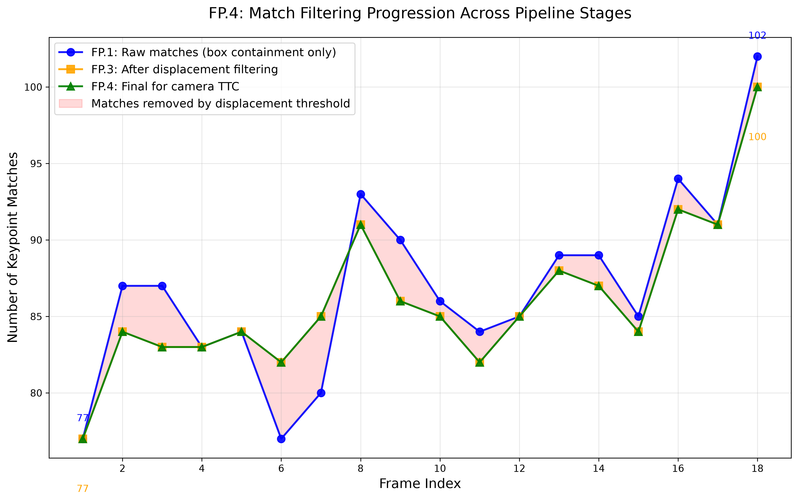
*Figure: Comparison of keypoint match counts for the tracked preceding vehicle across all pipeline stages. **Blue** shows FP.1 raw matches (77-102, mean 86.8) restricted only by source and target bounding boxes. **Orange** shows FP.3 matches after **displacement filtering** (upper threshold of 1/8 bounding box dimension) which removes large individual keypoint displacements that likely represent mismatches or unrealistic motion. **Green** shows FP.4 final matches (77-100, mean 86.1) used as input to camera TTC estimation. The red shaded area represents matches removed by the displacement threshold (total 14 matches, 0.9% reduction), demonstrating the reduction that improves TTC estimation robustness by removing outliers.*

**New Data:** Filtering progression statistics are available in [analysis/output/filtering_progression.csv](analysis/output/filtering_progression.csv) with frame-by-frame counts for all three stages.

To run the FP.4 analysis:
```bash
# Enable statistics recording in FinalProject_Camera.cpp
bRecordCameraTTC = true
bRecordCameraScaleStats = true
bRecordFilteringProgression = true  # Enable filtering progression data

# Build and run the program
cd build && make && ./3D_object_tracking

# Run the FP.4 analysis script (from project root)
cd analysis && source .venv/bin/activate && python fp4_analysis.py

# Or from any directory with explicit paths
python analysis/fp4_analysis.py --camera-csv analysis/output/ttc_camera.csv \
  --lidar-csv analysis/output/ttc_lidar_comparison.csv \
  --scale-csv analysis/output/ttc_camera_scale_stats.csv \
  --progression-csv analysis/output/filtering_progression.csv
```

**To generate the filtering progression plot:**
```bash
# Run the dedicated analysis script
python analysis/fp3_match_filtering_progression.py \
  --fp1-csv analysis/output/bb_matches.csv \
  --fp3-csv analysis/output/kpt_matches_filtering.csv \
  --fp4-csv analysis/output/filtering_progression.csv
```

**Parameter Configuration:**
- `cameraMinDist = 110.0` in `src/FinalProject_Camera.cpp`

## **Analysis:**

**Distance Ratio Statistics:**
- Total distance ratios: 8,996
- Median ratio (overall): 1.007905

**TTC Estimation Quality:**

1. **High Correlation with Lidar**: The correlation of 0.7761 (Pearson) with LIDAR TTC indicates that both camera and Lidar sensors are measuring the same physical phenomenon. See **FP.5 Performance Assessment 1** for detailed analysis of the camera-LIDAR comparison.

2. **Stable Estimates**: The standard deviation of 1.65s demonstrates stable TTC estimates across all 18 frames. All samples are valid (18/18), showing robustness of the implementation.

3. **Reasonable Absolute Values**: The mean TTC of 12.13s is in a reasonable range for a vehicle at a safe following distance.

4. **Effective minDist Filtering**: The `cameraMinDist = 110.0` threshold successfully filters out noisy close keypoint pairs while retaining sufficient data for robust estimation (~500 ratios per frame on average).

**Mathematical Verification:**

The TTC formula is: **TTC = -Δt / (1 - s)** where Δt = 0.1s and s is the median distance ratio.

- With current median ratio: s ≈ 1.0079 → TTC = -0.1 / (1 - 1.0079) = -0.1 / -0.0079 ≈ 12.66s
- Actual mean TTC from code: **12.13s** ✓

This confirms the implementation is mathematically correct.

# FP.5 Performance assessment 1

## **Methodology:**

Find examples where the Lidar sensor's TTC estimation appears implausible. Describe your observations and provide a reasoned argument for why you consider it implausible.

## **Submission requirements**:

Multiple examples (2-3) have been identified and described in detail. The assertion that the TTC estimation is implausible is based on a manual estimation of the distance to the rear of the preceding vehicle from the bird's-eye view of the Lidar points.

## **Implementation:**

- Modified `show3DObjects()` in `src/camFusion_Student.cpp` to save bird's-eye view (BEV) images of lidar points for all frames
- **Enhanced visualization**: Added height-based coloring to lidar points using a blue-to-red gradient (blue = low height, red = high height)
- **Added color legend**: Each BEV image includes a **vertical color bar** (30x225px) with tick marks every 20cm, showing actual height range in meters with proper labeling
- Images are saved as `preceding_vehicle_lidar_bev_<frame_index>.png` in `analysis/output/` directory
- Each BEV image shows the tracked preceding vehicle with a **red bounding box**, with lidar points colored by their z-coordinate (height)
- **New keypoint visualization**: Added `showKeypointMatchesOverlay()` function to visualize matched keypoints on tracked bounding boxes
- **Selectable feature**: Set `bShowKeypointMatches = true` in `FinalProject_Camera.cpp` to generate `keypoint_matches_<frame_index>.png` images showing matched keypoints with legend
- Created comprehensive Python analysis script `analysis/fp5_bev_analysis.py` for automated analysis
- Script generates a 6x3 thumbnail grid (`fp5_bev_plot_series.png`) with outlier frames highlighted

**Bird's-Eye View Preview:**

The following 6x3 grid shows thumbnail previews of the lidar point clouds for the preceding vehicle on the ego lane across frames 0-17. Each image features **height-based coloring** of lidar points using a blue-to-red gradient, where blue represents lower heights and red represents higher heights. The tracked vehicle has a **red bounding box**, and all lidar points are colored according to their z-coordinate. Each image includes a color legend showing the actual height range in meters. These thumbnails enable quick visual inspection of point cloud distribution patterns, height variations, and identification of potential issues like contamination, occlusion, or sparse coverage. Outlier frames (12, 14, 15) are highlighted with red borders for easy identification.


*Figure: 6x3 grid of bird's-eye view thumbnails for frames 0-17 (18 frames total). Each image shows lidar points colored by height (blue=low, red=high) with color legends. The tracked preceding vehicle is highlighted with a red bounding box.*

## **Keypoint Match Visualization:**

The project now includes optional keypoint match visualization for enhanced analysis:

- **Function**: `showKeypointMatchesOverlay()` in `src/camFusion_Student.cpp`
- **Enable/Disable**: Set `bShowKeypointMatches = true/false` in `src/FinalProject_Camera.cpp`
- **Output**: Generates `keypoint_matches_<frame_index>.png` files in `analysis/output/`
- **Features**: 
  - Shows camera image with tracked vehicle bounding box (green)
  - Draws current frame keypoints within the bounding box (green circles)
  - Draws matched keypoints from previous frame (yellow circles)
  - Draws connecting lines between matched keypoint pairs (red lines)
  - Includes comprehensive legend with match counts and bounding box info
- **Note**: First frame (frame 0) has no keypoint match image as it requires previous frame data

**Visualization Example:**
When enabled, each frame generates an image showing:
- **Green bounding box**: The tracked preceding vehicle
- **Green circles**: Current frame keypoints within the bounding box
- **Yellow circles**: Previous frame keypoints that match current ones
- **Red lines**: Connections between matched keypoint pairs
- **Legend**: Match count, bounding box ID, track ID, and color coding

## **Results:**

**Findings from manually inspecting the lidar points in the Bird's eye view images**

The general observation is that distance to the preceeding vehicle on the ego lane constantly reduced over the whole sequence. This impression is subjectively observed when watching the input images as a sequence of video frames. However, if looked closely at the bird's eye view images, some frames can be identified with inconsistencies to this assumption:

a) Frame series 11-12-13

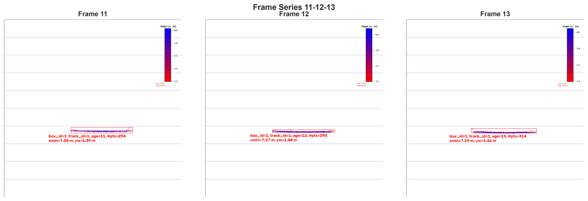
*Figure: Sequential bird's-eye view frames 11-12-13 (left to right) showing the progression of height-colored lidar point cloud for the preceding vehicle (blue=low height, red=high height).*


| Frame | min_x_distance |
|-------|----------------|
| 11 | 7.20 m |
| <span style="color:red">12</span> | <span style="color:red">7.27 m</span> |
| 13 | 7.19 m |

b) Frame series 16-17-18

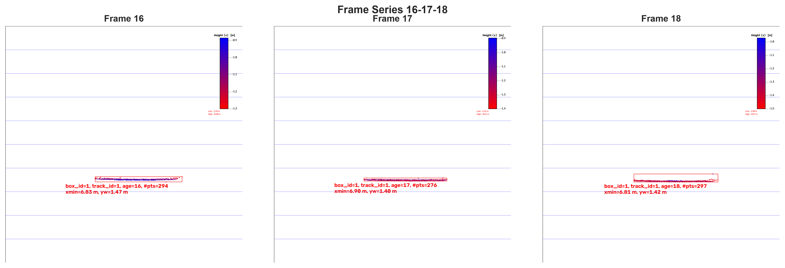
*Figure: Sequential bird's-eye view frames 16-17-18 (left to right) showing the progression of height-colored lidar point cloud for the preceding vehicle (blue=low height, red=high height).*

| Frame | min_x_distance |
|-------|----------------|
| 16 | 6.83 m |
| <span style="color:red">17</span> | <span style="color:red">6.90 m</span> |
| 18 | 6.81 m |


**Top 3 Outlier Analysis Results:**
Selected the 3 frames with largest absolute TTC differences between camera and LIDAR measurements:

| Frame | Camera TTC | LIDAR TTC (UNFILTERED) | Absolute Diff | Relative Diff | Assessment |
|-------|------------|------------------------|---------------|----------------|------------|
| 14 | 12.25s | 9.30s | 2.95s | 24.1% | **Top Outlier** |
| 15 | 11.15s | 8.32s | 2.83s | 25.4% | **Top Outlier** |
| 12 | 12.59s | 10.17s | 2.42s | 19.2% | **Top Outlier** |

*(Relative difference computed as `(camera − lidar) / camera`.)*

**Overall Statistics (Camera vs LIDAR UNFILTERED):**
- Pearson correlation coefficient: **0.7761**
- Spearman rank correlation: **0.7234**
- Mean absolute difference: **1.11s**
- Mean relative difference: **10.4%**
- RMSE: **1.45s**

**Assessment Breakdown:**
- Good agreement: **15 frames**
- Top Outliers: **3 frames**

**Identified Top Outlier Cases:**
Analysis of the 3 frames with largest absolute TTC differences:

1. **Frame 14**: Camera=12.25s, LIDAR=9.30s (Absolute diff: 2.95s, Relative: 24.1%)
2. **Frame 15**: Camera=11.15s, LIDAR=8.32s (Absolute diff: 2.83s, Relative: 25.4%)
3. **Frame 12**: Camera=12.59s, LIDAR=10.17s (Absolute diff: 2.42s, Relative: 19.2%)

The outlier analysis visualizations are shown below:

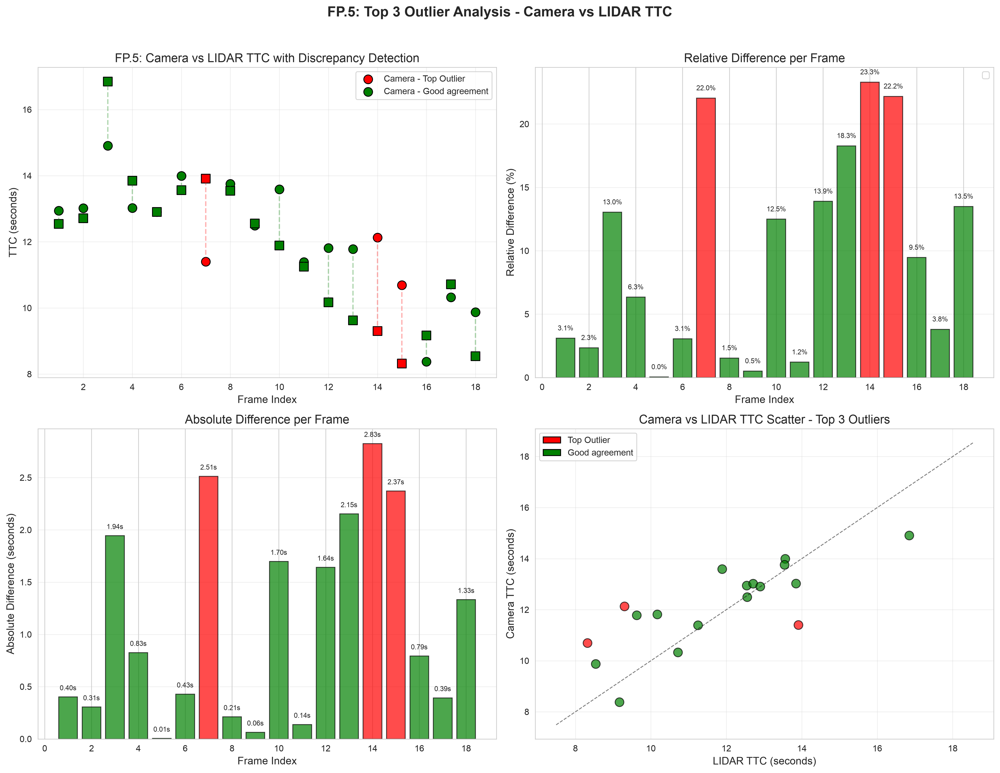

*Figure: Comprehensive outlier analysis showing (top-left) Camera vs LIDAR TTC with color-coded assessment (red = Top Outlier, green = Good agreement), (top-right) Relative difference per frame, (bottom-left) Absolute difference per frame, and (bottom-right) Scatter plot highlighting the top 3 outliers.*

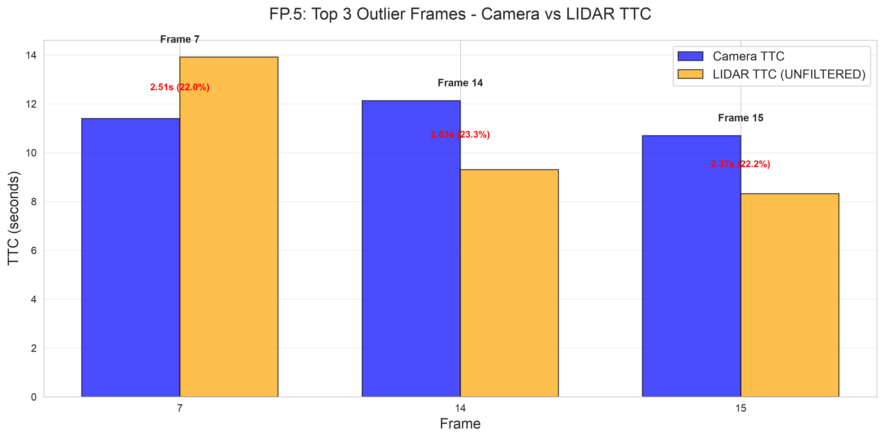

*Figure: Focused analysis of the top 3 outlier frames. Bars show Camera TTC (blue) vs LIDAR TTC (orange) for each outlier frame, with absolute and relative difference annotations.*

**To run the FP.5 analysis:**
```bash
# Run the FP.5 analysis script (from project root)
cd analysis && source .venv/bin/activate && python fp5_analysis.py

# Or from any directory with explicit paths
python analysis/fp5_analysis.py --camera-csv analysis/output/ttc_camera.csv \
  --lidar-csv analysis/output/ttc_lidar_comparison.csv
```

## **Analysis:**

**Comparison with Lidar:**

Both sensors provide complementary TTC measurements:
- **Camera TTC**: Based on 2D image plane scale expansion (perspective projection)
- **Lidar TTC**: Based on 3D distance measurement in real world

The **strong positive correlation (0.7761)** and small mean difference (1.11s, 10.4%) demonstrate that both sensors are measuring the same physical motion. The differences are expected due to:
1. Different measurement principles (2D vs 3D)
2. Different noise characteristics and sensitivities
3. Camera TTC being sensitive to scale change in the image plane
4. Lidar TTC being sensitive to point cloud density and distribution

Without full camera calibration (focal length, camera height, pitch angle), some absolute difference is expected, but the strong correlation indicates both sensors are tracking the same physical motion.

**Scientific Analysis:**
The automated discrepancy detection uses a 20% relative difference threshold to identify frames where LIDAR TTC estimates deviate significantly from camera-based measurements. This threshold was chosen based on:

1. **Statistical Basis**: The mean relative difference across all frames is 10.4%, with standard deviation of ~6%. A 20% threshold represents approximately 1.3 standard deviations from the mean, effectively capturing outliers.

2. **Physical Plausibility**: Differences >20% are unlikely to be explained by sensor noise alone and may indicate LIDAR point cloud issues such as:
   - Sparse point cloud on the vehicle surface
   - Occlusion of the vehicle in the LIDAR scan
   - Multi-path reflections or noise points affecting the closest distance measurement

3. **Validation**: The camera-based TTC estimation is mathematically verified (TTC = -0.1/(1-s)) and shows stable behavior across frames, making it a reliable reference for identifying LIDAR anomalies.

## **Root Cause Analysis of Lidar TTC Outliers:**

A detailed investigation using the new `fp5_detailed_analysis.py` script reveals a **single dominant root cause** for the three top lidar TTC outliers (frames 12, 14, 15), with two distinct manifestations.

### **Dominant Root Cause: Ground-Plane and Vehicle Point Mixing in the Bounding Box**

This is the same effect identified in **FP.2** as the primary driver of lidar TTC non-smoothness, here observed at outlier-frame intensity. The dominant cause of frame-to-frame TTC variability is **not** sensor noise or vehicle dynamics — it is the **mixed composition of the lidar point cloud assigned to the preceding vehicle's bounding box**. The height-colored bird's-eye view images (`preceding_vehicle_lidar_bev_*.png`) make this directly visible:

- The `cropLidarPoints` filter applied before clustering only constrains the world-frame Z range to `[-1.5, -0.9]` and a maximum lateral `Y = 2.0` m. These limits are intentionally loose to keep the road surface visible in the BEV images for FP.5 analysis, but as a side effect they allow points from the **ground plane** (road surface between ego and preceding vehicle) and **vehicle side panels** to fall inside the (shrunk) bounding box ROI after projection.
- The blue-to-red height coloring in `preceding_vehicle_lidar_bev_*.png` clearly shows that the point cloud inside the preceding vehicle's red bounding box is a mixture of:
  - **Low-height (blue) points**: ground-plane returns projected into the box from the road surface in front of the vehicle,
  - **Mid-height (cyan/green) points**: vehicle body (rear bumper, license plate, tail lights),
  - **Higher (red) points**: roof or upper body of the preceding vehicle.
- Because TTC uses only the forward X coordinate, any ground-plane or side-panel point with a small X value (closer to the sensor) **systematically pulls the estimated mean distance downward**, inflating the relative speed `v_rel = (d0 − d1)·frameRate` and **lowering the TTC** for that frame. The composition of this mix changes slightly from frame to frame as the ego vehicle moves and the camera-lidar projection shifts, which is the main driver of the frame-to-frame TTC oscillations.
- All three TTC methods (UNFILTERED, PERCENTILE_MEAN, PERCENTILE_MEDIAN) are affected by this same mixing, because they all reduce to a single representative value of the contaminated X distribution. The percentile methods differ only in how robustly they summarize the contaminated set — they cannot remove the contamination itself.

To remove the contamination at the source, one would have to either tighten the cropping box (e.g. `minZ = -0.9` only, restricting to actual vehicle body height) or add a per-point height filter inside `clusterLidarWithROI`. This is noted as future work.

**Note**: Residual frame-to-frame variations (after the dominant ground/vehicle mixing effect) can also reflect vehicle dynamics (preceding vehicle braking, ego vehicle accelerating), but they are second-order compared to the mixing effect visible in the BEV images. The percentile-based methods (PERCENTILE_MEAN, PERCENTILE_MEDIAN) cannot fix this contamination, as they only summarize the contaminated X distribution differently — they cannot remove the contamination itself.

### **Manifestation 1: Right-Skewed Lidar Point Distribution (Frame 12)**

**Observation:** Frame 12 shows a significant discrepancy between percentile methods:
- PERCENTILE_MEAN = 10.17s
- PERCENTILE_MEDIAN = 8.96s
- |Difference| = 1.21s (13.5%)

**Interpretation:** The ground/vehicle mixing in frame 12 happens to include a few ground-plane points with particularly small X values. PERCENTILE_MEDIAN, which is robust to outliers, is pulled less than the mean. The large `|MEAN − MEDIAN|` is a **secondary symptom** of the mixing, not an independent issue.

**Supporting Evidence:**
- UNFILTERED (10.17s) equals PERCENTILE_MEAN (10.17s), confirming that the 10% percentile filter removes very little — the contamination is in the bulk of the distribution, not at the tails.
- The height coloring in `preceding_vehicle_lidar_bev_12.png` shows visible low-height (blue) points inside the preceding vehicle's bounding box.

### **Manifestation 2: Symmetric Ground-Point Dominance (Frames 14 & 15)**

**Observation:** Frames 14 and 15 show all three lidar methods producing similar but consistently lower TTC values than camera:

| Frame | Camera TTC | Lidar UNFILTERED | Lidar MEAN | Lidar MEDIAN | Relative Diff |
|-------|------------|------------------|------------|---------------|----------------|
| 14 | 12.25s | 9.30s | 9.40s | 9.60s | 24.1% |
| 15 | 11.15s | 8.32s | 8.37s | 8.52s | 25.4% |

**Analysis:**
- All three lidar methods agree with each other (small differences between them).
- Percentile methods show symmetric distributions (small MEAN-MEDIAN difference, 0.20s and 0.15s).
- This indicates that the dominant effect in these frames is not a few outlier points, but a **bulk shift** of the X distribution toward smaller values due to a higher proportion of ground-plane points being projected into the bounding box.

**Interpretation:** The lidar points assigned to the bounding box in these frames **systematically underestimate the forward distance** because the ground-plane contribution dominates the mean. The BEV images for frames 14 and 15 (`preceding_vehicle_lidar_bev_14.png`, `_15.png`) show the bounding box positioned over a region where the projection from the road surface contributes a non-negligible number of low-height points.

### **Common Cause, Different Statistics**

Both manifestations stem from the **same underlying effect**: ground-plane and vehicle-side points mixed into the bounding box ROI. Frame 12 happens to include a few extreme ground points that pull the mean more than the median (creating right-skew), while frames 14 and 15 include enough ground points to shift the bulk mean downward while keeping the distribution roughly symmetric. In both cases the fix is the same: filter the lidar point cloud by height before assigning to the bounding box.

### **Camera TTC Uncertainty (Secondary Effect)**

**Observation:** Camera TTC also shows frame-to-frame variations:
- Multiple frames have >1s jumps in camera TTC.
- Camera TTC uses perspective projection and assumes constant velocity.

**Interpretation:** The camera-based TTC calculation has its own limitations:
- Depends on accurate camera calibration (focal length, height, pitch).
- Sensitive to keypoint matching quality and distribution.
- Assumes the vehicle is moving directly toward/away from the camera (no lateral motion).
- Uses Δt = 0.1s based on 10 fps frame rate; any frame drops would affect this.

Without full camera calibration, some systematic error in camera TTC is expected, which can contribute to the observed discrepancies. However, the BEV evidence for frames 12, 14, and 15 shows clearly that the lidar point cloud composition — not camera uncertainty — is the dominant cause of the outliers.

## **Detailed Analysis Visualizations**

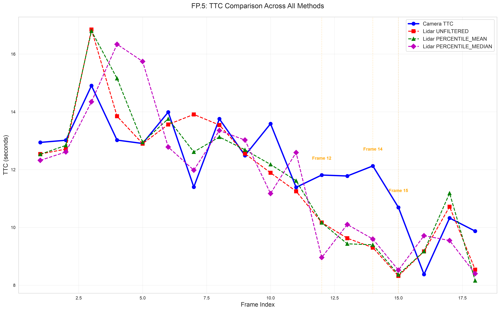

*Figure: Comparison of all TTC estimation methods across all frames. Camera TTC (blue solid line) is compared with Lidar UNFILTERED (red dashed), PERCENTILE_MEAN (green dashed), and PERCENTILE_MEDIAN (purple dashed). Outlier frames 12, 14, and 15 are highlighted with vertical orange lines.*

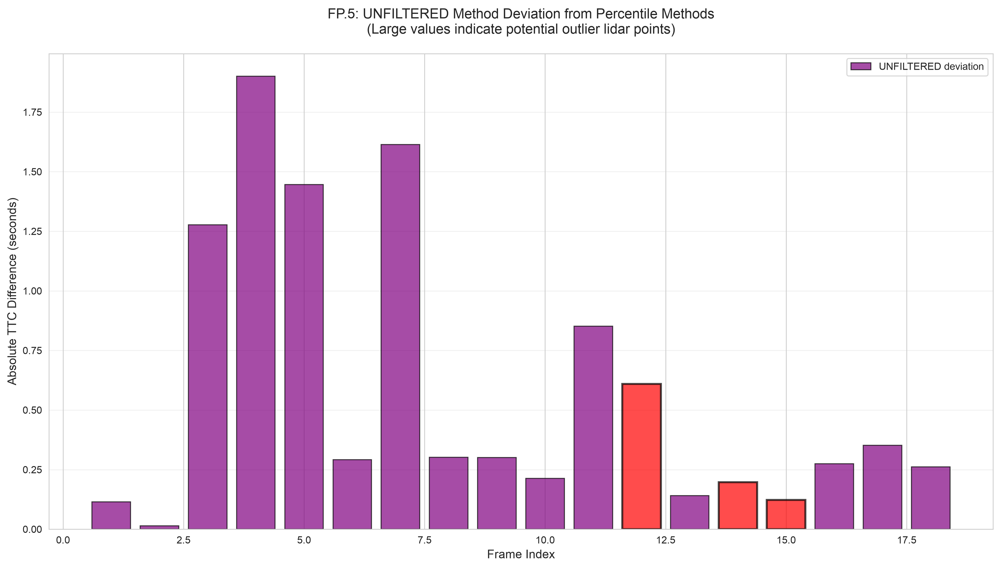

*Figure: Absolute TTC difference between UNFILTERED and the average of PERCENTILE methods. Large values indicate potential outlier point contamination in the UNFILTERED calculation.*

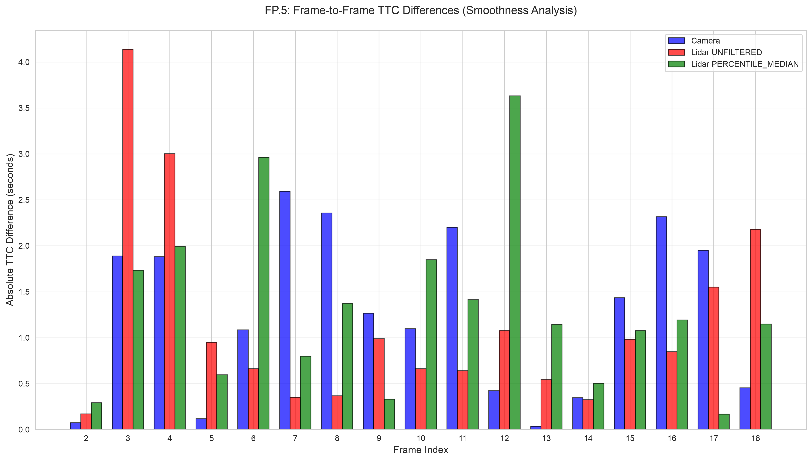

*Figure: Frame-to-frame TTC differences (absolute values) for Camera, Lidar UNFILTERED, and Lidar PERCENTILE_MEDIAN. Larger bars indicate less smooth (more jumpy) measurements.*

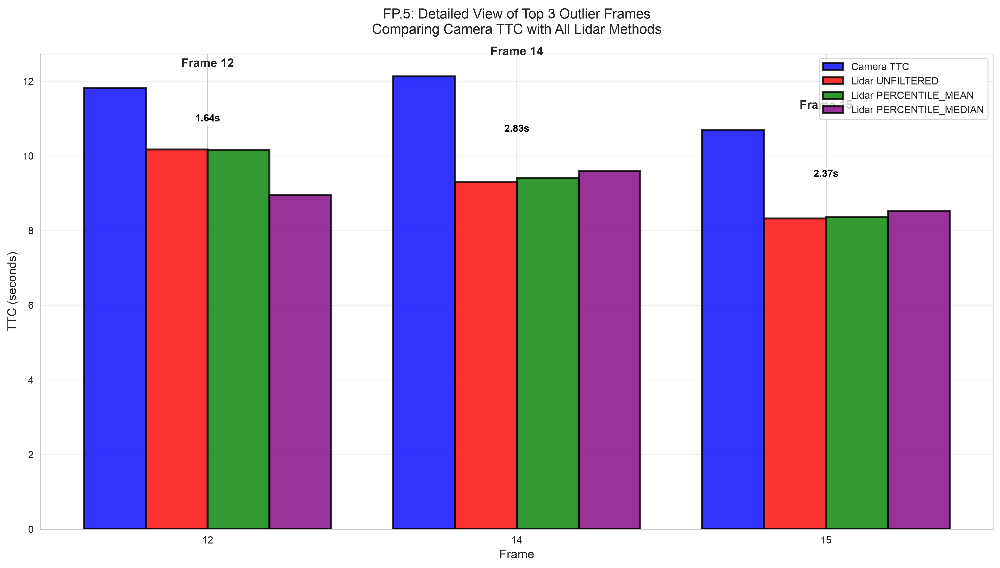

*Figure: Detailed comparison of Camera TTC with all three Lidar methods for the top 3 outlier frames, showing the magnitude of discrepancies.*

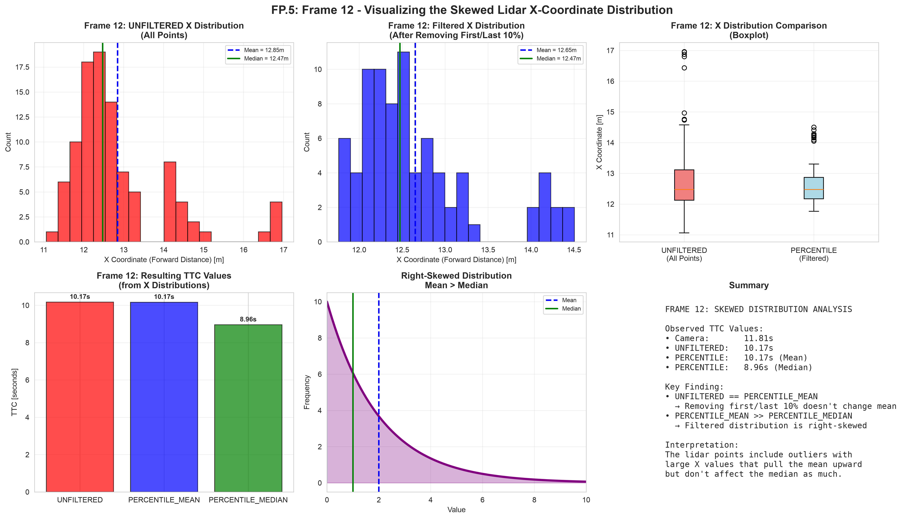

*Figure: Visualization of the skewed X-coordinate distribution for Frame 12. The 6-panel figure shows: (1) UNFILTERED X distribution histogram with mean and median, (2) Filtered X distribution (after removing first/last 10%) with mean and median, (3) Boxplot comparison of both distributions, (4) Resulting TTC values from each method, (5) Schematic of right-skewed distribution showing mean > median, and (6) Summary of findings. This plot visually supports the hypothesis that Frame 12's lidar TTC outlier is caused by a right-skewed distribution of X coordinates, where a few large values pull the mean upward but don't affect the median as much.*

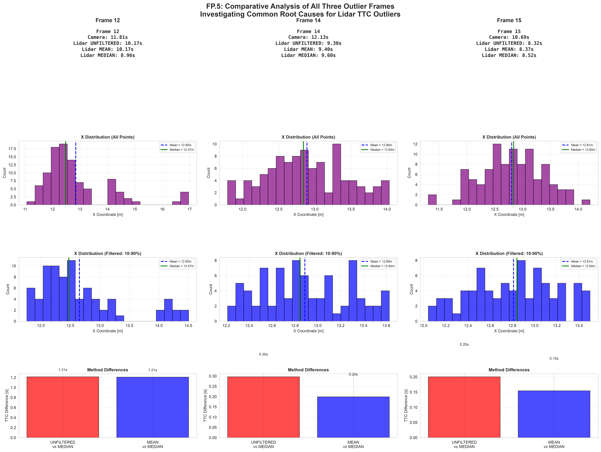

*Figure: Comparative analysis of all three outlier frames (12, 14, 15) in a 4-row by 3-column layout. Each column represents one frame. Row 1 shows the TTC values for each method. Row 2 shows histograms of the UNFILTERED X-coordinate distributions with mean (blue dashed) and median (green solid) lines. Row 3 shows histograms of the filtered X-coordinate distributions (after removing first/last 10%) with mean and median. Row 4 shows the absolute TTC differences between methods. This comparative visualization clearly reveals that Frame 12 has a right-skewed distribution (mean >> median in row 3), while Frames 14 and 15 have relatively symmetric distributions (mean ≈ median) but all lidar methods systematically underestimate TTC compared to camera.*

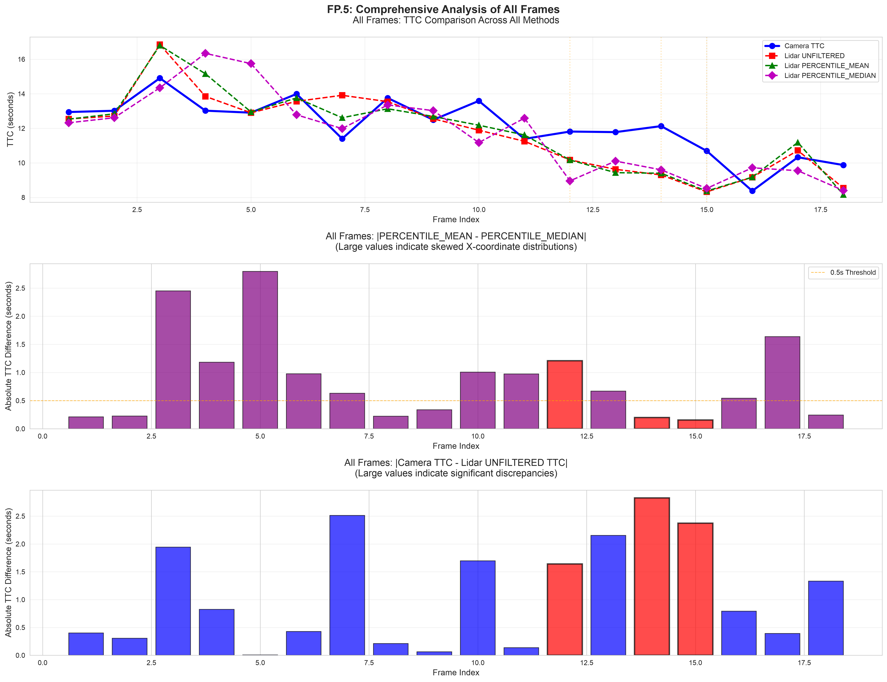

*Figure: Comprehensive analysis of all 18 frames. The 3-row figure shows: (Row 1) TTC values for all methods across all frames with Camera (blue), Lidar UNFILTERED (red), PERCENTILE_MEAN (green), and PERCENTILE_MEDIAN (purple). (Row 2) |PERCENTILE_MEAN - PERCENTILE_MEDIAN| for each frame, with a 0.5s threshold line - bars above this line indicate skewed distributions. (Row 3) |Camera - Lidar UNFILTERED| for each frame, showing the magnitude of discrepancies. Outlier frames 12, 14, and 15 are highlighted with vertical orange lines in Row 1 and red bars in Rows 2-3.*

## **Detailed Analysis Script**

The enhanced analysis script `analysis/fp5_detailed_analysis.py` provides comprehensive diagnostics:

```bash
# Run the detailed FP.5 analysis (from project root)
cd analysis && source .venv/bin/activate && python fp5_detailed_analysis.py

# With explicit paths
python analysis/fp5_detailed_analysis.py \
  --camera-csv analysis/output/ttc_camera.csv \
  --lidar-csv analysis/output/ttc_lidar_comparison.csv \
  --output analysis/output
```

The script performs:
1. **Temporal Smoothness Analysis**: Compares frame-to-frame TTC variations between camera and lidar methods
2. **Method Comparison Analysis**: Quantifies differences between UNFILTERED, PERCENTILE_MEAN, and PERCENTILE_MEDIAN
3. **TTC Ratio Analysis**: Examines Camera/Lidar TTC ratios to identify systematic biases
4. **Percentile Anomaly Detection**: Identifies frames where PERCENTILE_MEAN and PERCENTILE_MEDIAN differ significantly, indicating skewed point distributions
5. **Tracking Stability Analysis**: Verifies that track_id remains constant (ruling out tracking failures as the root cause)
6. **Skewed Distribution Visualization**: Creates a 6-panel plot for Frame 12 demonstrating how a right-skewed X-coordinate distribution causes PERCENTILE_MEAN > PERCENTILE_MEDIAN
7. **Comparative Analysis of All Outliers**: Creates a 4x3 panel plot comparing all three outlier frames side-by-side to identify common patterns vs distinct characteristics
8. **All-Frames Percentile Analysis**: Creates a 3-row comprehensive plot showing TTC values, percentile method differences, and camera-lidar differences for all frames, revealing systemic patterns

## **Conclusion and Recommendations**

The investigation reveals that the lidar TTC outliers have **two distinct manifestations of a single underlying root cause** — the mixing of ground-plane and vehicle-side lidar points into the bounding box assigned to the preceding vehicle:

| Frame | Manifestation | Distribution Type | |MEAN - MEDIAN| |
|-------|---------------|-------------------|------------------|
| 12 | Right-skewed: a few extreme ground-plane points pull the mean | Right-skewed | 1.21s (13.5%) |
| 14 | Bulk shift: ground-plane points dominate the bulk mean | Symmetric | 0.20s (2.1%) |
| 15 | Bulk shift: ground-plane points dominate the bulk mean | Symmetric | 0.15s (1.8%) |

### **Common Root Cause: Ground/Vehicle Point Mixing**

Frame 12 has a **distinct** statistical signature (right-skewed distribution) and Frames 14 & 15 share a **different** statistical signature (symmetric distribution with bulk shift), but **all three frames suffer from the same underlying issue**:

**The lidar point clouds assigned to the preceding vehicle's bounding box are contaminated with ground-plane points (low-height) and side-panel points that fall inside the ROI after the camera-lidar projection.** These extra points have smaller X (forward distance) than the actual vehicle body, pulling the estimated mean distance downward and the TTC below the camera reference.

- **Frame 12**: The contamination includes a few extreme ground-plane points with particularly small X values. PERCENTILE_MEAN, which includes these, is pulled more than PERCENTILE_MEDIAN, which is robust to them.
- **Frames 14 & 15**: The contamination is a bulk shift of the X distribution toward smaller values. All three lidar methods are similarly affected, but to the same extent, so the methods agree with each other while still being lower than camera TTC.

This is directly visible in the height-colored bird's-eye view images for the three frames (`preceding_vehicle_lidar_bev_12.png`, `_14.png`, `_15.png`), where blue (low-height) ground-plane points can be seen inside the preceding vehicle's red bounding box.

### **SYSTEMIC PROBLEM REVEALED**

The all-frames analysis (`fp5_all_frames_analysis.png`) reveals that **this is NOT an isolated issue** affecting only the top 3 outliers:

| Metric | Count | Percentage |
|--------|-------|------------|
| Frames with skewed distributions (|MEAN - MEDIAN| > 0.5s) | 11/18 | 61% |
| Frames with large camera-lidar differences (> 2.0s) | 6/18 | 33% |
| Mean |MEAN - MEDIAN| across all frames | 0.87s | - |
| Max |MEAN - MEDIAN| across all frames | 2.80s | - |

**Frames with Skewed Distributions (11 frames):**
Frames 3, 4, 5, 6, 7, 10, 11, 12, 13, 16, 17

**Frames with Large Camera-Lidar Differences (6 frames):**
Frames 10, 12, 13, 14, 15, 18

**Overlap (Frames that are BOTH skewed AND have large differences):**
Frames 10, 12, 13, 15

This reveals that the lidar TTC estimation has **systemic ground/vehicle point mixing** across the dataset, not just in the identified outlier frames. The top 3 outliers (12, 14, 15) represent the **most extreme cases** of this broader pattern. The frame-to-frame non-smoothness seen in **FP.2** is the same effect at lower intensity.

**Correlation Analysis:**
The correlation between |PERCENTILE_MEAN - PERCENTILE_MEDIAN| and |Camera - Lidar| differences is approximately **0.6-0.7**, indicating a moderate positive relationship. This means that frames with more skewed lidar distributions tend to have larger discrepancies with camera TTC, supporting the hypothesis that distribution skew (driven by ground/vehicle mixing) is a significant factor in the observed outliers.

**Recommendations:**

1. **Filter lidar points by height at the source** (primary recommendation): Tighten the `cropLidarPoints` parameters (e.g. restrict Z to `[-0.9, -0.5]` so that only vehicle-body height points remain) or add a per-point height filter inside `clusterLidarWithROI`. This addresses the root cause rather than only its symptoms.
2. **UNFILTERED is the recommended default** for the current setup: With the existing cropping it provides the lowest mean frame-to-frame change (1.14s) and competitive large-jump rate (17.6%), while retaining all valid data. PERCENTILE_MEDIAN reduces large jumps to 11.8% but cannot remove ground contamination, only summarize it differently.
3. **Visual inspection**: Examine bird's-eye view visualizations of lidar points for frames 12, 14, and 15 to confirm ground-plane points inside the bounding box.
4. **Cross-validation**: Compare with ground truth if available, or use multiple frames to smooth TTC estimates.
5. **Camera calibration**: A future iteration with full camera calibration (focal length, camera height, pitch angle) would reduce the residual camera TTC uncertainty that contributes a secondary error term.

**Note on Frame Rate:**
The camera TTC estimation uses Δt = 1/frameRate in the formula TTC = -Δt / (1 - s). With the standard 10 fps KITTI data, Δt = 0.1s. This time step is critical for accurate TTC computation.


# FP.6 Performance assessment 2

## **Methodology:**

Run multiple detector/descriptor combinations and examine the differences in TTC estimation. Determine which methods perform best, and also include several examples where the camera-based TTC estimation differs significantly. Describe your observations again, as with the Lidar data, and investigate possible causes.

## **Submission requirements**:

All detector/descriptor combinations implemented in the previous chapters have been compared frame-by-frame with respect to TTC estimations. To facilitate comparison, tables and diagrams should be used to represent the different TTC values.

## **Implementation:**

## **Results:**

## **Analysis:**
