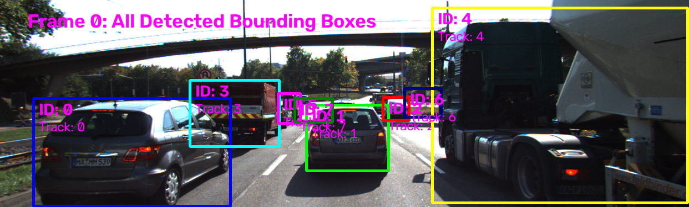
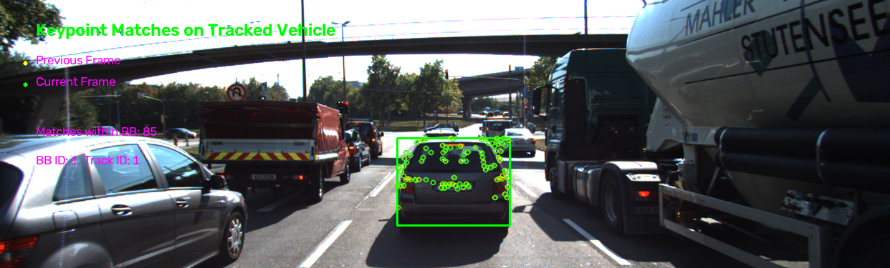
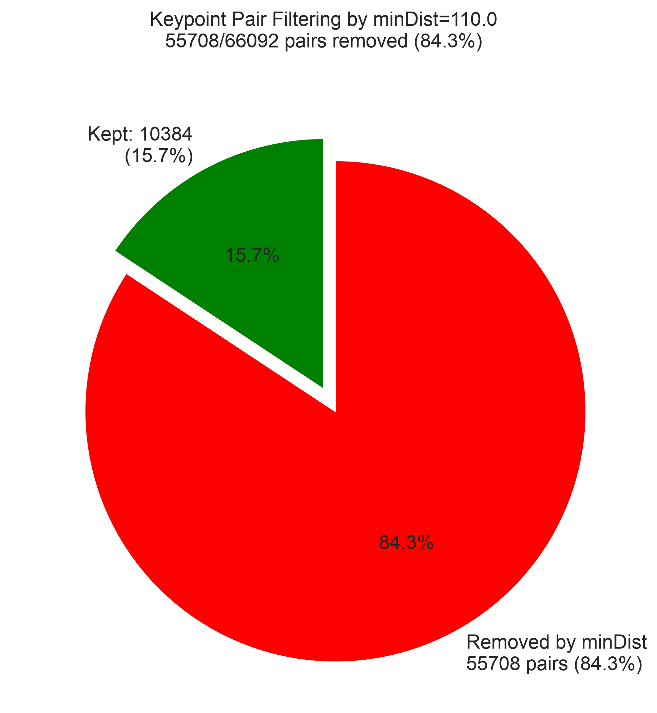
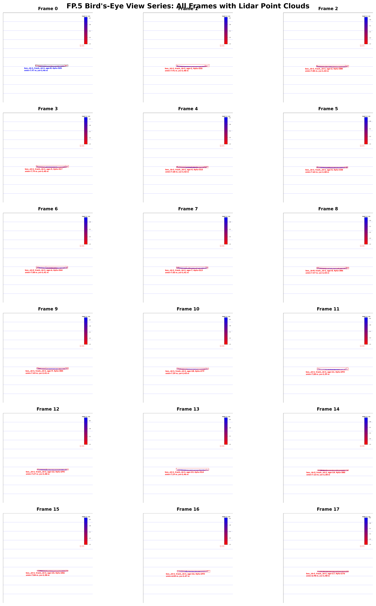
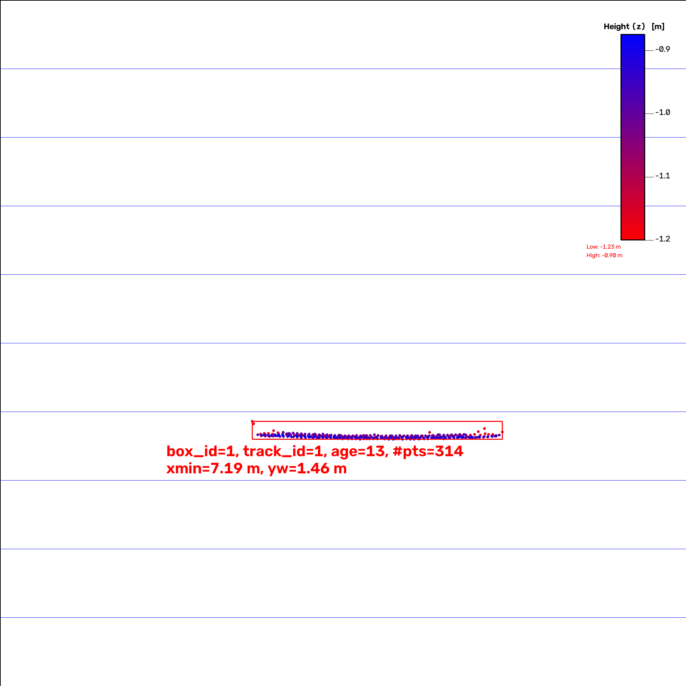
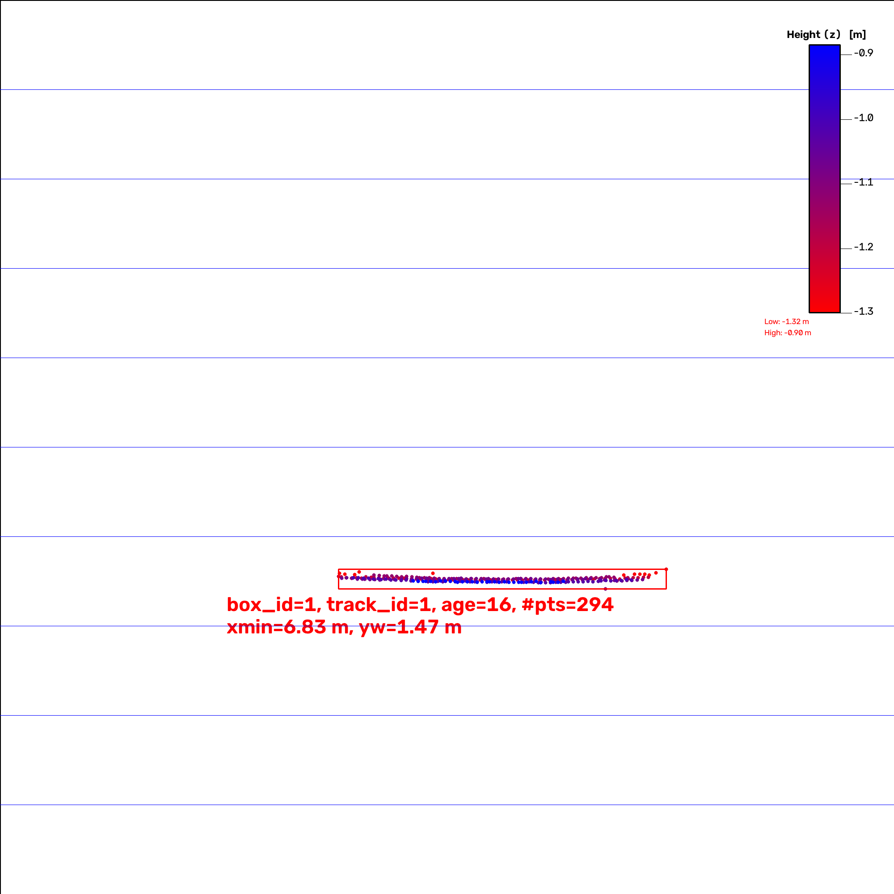

# sensor_fusion_ttc_comparison

Track objects over time and estimate their TTC using lidar and camera data

> **Note on keypoint_lib directory:** This project incorporates the `keypoint_lib` directory from the previous midterm project (2D Feature Tracking). The library was carried over to avoid rewriting the modern detector and descriptor implementations (HARRIS, FAST, BRISK, ORB, AKAZE, SIFT for detection; BRIEF, ORB, FREAK, AKAZE, SIFT for description). All keypoint detection, descriptor extraction, and descriptor matching in this project now uses the refactored `keypoint_lib` namespace functions (`kp::`, `desc::`, `match::`) instead of the legacy implementations.

## Dependencies

- CMake >= 4.4.2
- OpenCV >= 5.0.0
- yaml-cpp library (for parsing COCO class names from YAML files)
- C++17 compatible compiler

## Tested Environment

This project has been tested on **macOS Sequoia 26.6.1** using Homebrew for package management.

> **Note:** The Linux setup instructions below are provided as reference only and have **not been tested**. 
> Linux support is not currently within the scope of this project.

## Model Files

### YOLOv7-tiny ONNX Model (Recommended)

This project uses a compressed YOLOv7-tiny ONNX model to limit bandwidth and data needed for setup. The model file `yolov7-tiny.onnx.gz` (~20-25MB) is included in the repository. It will provide reasonable box detections for the objects in the provided scene. As a side effect its faster to execute just because of its smaller size than the full YOLOv7.

**Setup Steps:**

1. **Decompress the model** (required before running):
   ```bash
   # Navigate to the yolo data directory
   cd dat/yolo/
   
   # Decompress the model
   gunzip -k yolov7-tiny.onnx.gz
   
   # Expected output:
   # This creates yolov7-tiny.onnx (approximately 24MB) in the same directory
   # The -k flag keeps the original .gz file
   ```

2. **Verify the file exists:**
   ```bash
   ls -lh dat/yolo/yolov7-tiny.onnx
   # Expected output: -rw-r--r--  1 user  staff   24M [date] yolov7-tiny.onnx
   ```

3. **The code will automatically load** `dat/yolo/yolov7-tiny.onnx` at runtime.

> **Note:** The repository includes `yolov7-tiny.onnx.gz` to reduce bandwidth. GitHub's free tier supports files up to 100MB without requiring Git LFS, so no additional configuration is needed.

### Other ONNX models with OpenCV 5+
The code supports other ONNX models. But it needs an input size of 640x640 and 3 channels (RGB images).

How uo use:
1. Download an ONNX model (e.g., from [ONNX Model Zoo](https://github.com/onnx/models/tree/main/vision/object_detection_segmentation/yolov3) or [Hugging Face](https://huggingface.co/models?search=yolov3))
2. Place the `.onnx` file in `dat/yolo/` directory
3. Update the model filename in `src/FinalProject_Camera.cpp` (line 60)

## Setup

### macOS (Homebrew) - *only tested system*

```bash
# Install CMake (minimum 4.4.2)
brew install cmake

# Install OpenCV 5.x
brew install opencv@5

# Install yaml-cpp for YAML file parsing (COCO class names)
brew install yaml-cpp

# Clone and build
cd sensor_fusion_ttc_comparison
mkdir build && cd build
# Note: If OpenCV 5 or yaml-cpp is not found, set the paths explicitly
CMAKE_PREFIX_PATH=/opt/homebrew/opt/opencv:/opt/homebrew/opt/yaml-cpp cmake ..
make
```

## Running the Executable

After building, run the executable from the `build/` directory:

```bash
./3D_object_tracking          # default: no waiting (fully automated run)
./3D_object_tracking 0        # no waiting (equivalent to default)
./3D_object_tracking 1        # wait for a keypress after each frame (interactive)
```

The optional first argument selects between an automated run (default, no waiting) and an interactive run where the program pauses for a keypress after each frame. This is useful for visually inspecting the bird's-eye view and keypoint match images during debugging. Any value other than `0`/`false`/`no` enables waiting; any invalid argument falls back to no-waiting with a warning.

### Linux (apt) - *not tested*

> **Note:** These instructions have not been tested and are provided as reference only.
> Linux support is currently not within the project scope.

```bash
# Install CMake (minimum 4.4.2)
sudo apt-get install cmake

# Install OpenCV 5.x (from source or PPA)
sudo apt-get install libopencv-dev

# Install yaml-cpp for YAML file parsing
sudo apt-get install libyaml-cpp-dev

# Clone and build
cd sensor_fusion_ttc_comparison
mkdir build && cd build
cmake ..
make
```

## ONNX Model Information

The YOLOv7-tiny ONNX model (`yolov7-tiny.onnx`) is converted from the original github repo pytorch model via the projects export.py script:

TORCH_FORCE_WEIGHTS_ONLY_LOAD=0 uv run python export.py --weights yolov7-tiny.pt --grid --simplify --img-size 640 640 --max-wh 640

### Preprocessing
- Normalize image to [0, 1] range
- Resize to 640x640 using letterbox (maintain aspect ratio with padding)
- no mean subtraction

### Postprocessing
Use opencv 5's Non-Max Suppression (NMS) with the output tensors to get final detections.

---
---
---

# Python Analysis Setup

The project includes Python scripts for analyzing FP.1 (bounding box matching), FP.2 (Lidar TTC), FP.3 (keypoint match filtering), and FP.4 (camera TTC) results as well as for the performance analysis in Fp.5 and FP.6.

## Prerequisites

- Python 3.12 or higher (only tested with 3.12!)
- [uv](https://github.com/astral-sh/uv) - Python package manager (recommended)

## Setup with uv

To set up the Python analysis environment:

```bash
# 1. Install uv if not already installed
# On macOS with Homebrew:
brew install uv

# Or download the standalone binary (recommended for latest version):
curl -LsSf https://astral.sh/uv/install.sh | sh

# 2. Verify uv installation
uv --version

# 3. Navigate to the analysis directory
cd analysis

# 4. Create virtual environment and install dependencies
# Method A: Using uv sync (creates .venv)
uv sync

# Method B: Manual virtual environment setup
uv venv
source .venv/bin/activate  # On macOS/Linux
# or: .\.venv\Scripts\activate  # On Windows
uv pip install pandas seaborn matplotlib numpy
```

## Running the Analysis

After running the C++ executable (which generates CSV files in `analysis/output/`), run the analysis scripts:

```bash
# From the project root (CSV files are automatically found in analysis/output/)
cd analysis && source .venv/bin/activate

# Run FP.1 analysis
python fp1_analysis.py

# Run FP.2 analysis  
python fp2_analysis.py

# Run FP.3 analysis
python fp3_analysis.py

# Run FP.4 analysis
python fp4_analysis.py

# Run FP.5 analysis
python fp5_analysis.py

# Run FP.6 analysis
python fp6_analysis.py
```

The scripts will:
- Generate plots showing results for each FP task
- Save the plots as PNG files in the `analysis/output/` directory
- Print summary statistics to the console

Use `--help` to see all available options:
```bash
python fp1_analysis.py --help
```

## Dependencies

The Python analysis requires:
- **pandas**: Data manipulation and CSV reading
- **seaborn**: Statistical data visualization
- **matplotlib**: Plotting library
- **numpy**: Numerical operations

All dependencies are specified in `analysis/pyproject.toml` for uv-based installation.

## Fallback: Using pip directly

If you prefer not to use uv, you can install dependencies directly with pip:

```bash
cd analysis
python -m venv .venv
source .venv/bin/activate  # On macOS/Linux
# or: .\.venv\Scripts\activate  # On Windows
pip install -r requirements.txt
```

---

# FP.0 - FINAL PROJECT REPORT

## **Methodology:**

Create a README file or other documentation that contains all evaluation criteria and describes how you have addressed each individual point.

## **Submission requirements**:

The report/README should contain an explanation and supporting illustrations that explain how each evaluation criterion was addressed, and in particular at which point in the code each step was handled.

## **Implementation:**
Setup this project report structure.

# FP.1 Match 3D objects

## **Methodology:**

Implement the method "matchBoundingBoxes," which receives both the previous and the current data frame as input and outputs the IDs of the assigned regions of interest (the "boxID" attribute). A bounding box from the previous frame is matched/associated to that bounding box of the current frame with which it has the highest number of keypoint matches. These bounding box matches have to be unique.

**Note:** Vehicle tracking with persistent track IDs is addressed in FP.3 as part of the keypoint match assignment process.

## **Submission requirements:**

The code is functional and produces the specified output, with each bounding box assigned to the matches with the highest number of keypoint matches.

## **Implementation:**

The implementation follows a multi-step approach:

1. **Count keypoint matches between bounding boxes**: For each keypoint match, it's determined which bounding box in the previous frame contains the previous keypoint and which bounding box in the current frame contains the current keypoint. The count of matches for each (prevBoxID, currBoxID) pair is maintained.

2. **Find best matches**: For each bounding box in the previous frame, the bounding box in the current frame with the highest number of keypoint matches is selected.

**Note:** Track ID assignment, vehicle tracking and Keypoint visualization are implemented as part of FP.3.

The implementation uses modern C++ features:
- `std::find_if` with lambda functions for finding bounding boxes containing keypoints
- `std::max_element` for finding the current box with maximum matches

Currently, the standard detector/descriptor pair (SHITOMASI detector with ORB descriptor) is preselected for the main pipeline. However, the codebase is prepared for comprehensive testing of all detector-descriptor combinations through the `bTestAllCombinations` flag for FP.6. Results will be exported to `detector_descriptor_results.csv` for evaluation.

The bounding box matching results (frame index, previous box ID, current box ID, match count) are exported to `analysis/output/bb_matches.csv` for analysis using the Python script `analysis/fp1_analysis.py`.

## **Results:**

The bounding box matching implementation successfully associates objects between consecutive frames based on keypoint match counts. The `matchBoundingBoxes` function correctly identifies the best matching bounding box pairs, ensuring unique assignments and providing the foundation for subsequent tracking and TTC calculations.

**Object Detection Visualization:**
The following image illustrates the results of the object detection pipeline for the first frame, showing all detected bounding boxes:


*Figure: Object detection results for frame 0. All detected vehicles are shown with their bounding boxes, colored uniquely and labeled with boxID and trackID. This demonstrates the YOLO-based object detection capability that provides input for subsequent bounding box matching in FP.1.*

**Note:** Persistent track IDs are implemented as part of FP.3, which builds upon the bounding box matching results from FP.1.

The keypoint match results (frame index, previous box ID, current box ID, match count, etc.) are exported to `analysis/output/bb_matches.csv` for analysis using the Python script `analysis/fp1_analysis.py`. The analysis script reads the tracked preceding vehicle's track_id from `tracked_preceding_vehicle_track_id.txt` and filters the data to show only matches for **the preceding vehicle on the ego lane**. The following plot shows the number of matches over frames for the tracked preceding vehicle:


*Figure: Number of keypoint matches over frames for the **preceding vehicle on the ego lane** using SHITOMASI detector and ORB descriptor. The plot shows raw match counts ranging from **77 to 102** (mean: **86.8**), considering only bounding box containment (source and target ROIs) without additional distance filtering.*

## **Analysis:**

- **Stability**: The number of matches remains relatively stable across frames, with some fluctuations visible. This indicates that the detector-descriptor pair is consistently finding and matching the image features over the whole sequence.

- **Computational efficiency**: Both SHITOMASI and ORB are computationally efficient, making them suitable for real-time applications.

The analysis script (`analysis/fp1_analysis.py`) uses seaborn for visualization and provides summary statistics including total frames processed, total matches recorded, and per-frame match statistics. This enables quantitative evaluation of different detector-descriptor combinations for future optimization. It was partly carried over from the previous projects.

# FP.2 Calculate TTC based on Lidar

## **Methodology:**

Calculate the Time To Collision (TTC) in seconds for all matched 3D objects, using only the Lidar measurements from the matched bounding boxes between the current and previous frame. The implementation supports three different outlier handling strategies for comparative analysis:
- **UNFILTERED**: Raw mean of all X-coordinates (baseline, no filtering)
- **PERCENTILE_MEAN**: Remove first and last 10% of sorted X values, then compute mean
- **PERCENTILE_MEDIAN**: Remove first and last 10% of sorted X values, then compute median

## **Submission requirements**:

The code is functional and produces the specified output. Additionally, the code handles outliers in Lidar points in a statistically robust manner to avoid serious estimation errors.

## **Implementation:**

- Implemented `computeTTCLidar()` in `src/camFusion_Student.cpp` with enum-based method selection (`TTCMethod`)
- Added percentile filtering helper function `filterPercentiles()` for removing extreme values (first and last 10%)
- Implemented vehicle identification with `findPrecedingVehicleBox()` to identify the preceding vehicle on the ego lane
- Integrated configurable method selection in `src/FinalProject_Camera.cpp` with:
  - `TTCMethod ttcLidarMethod` for default method selection
  - `bTestAllTTCMethods` flag to enable comparison mode
- Added comparison mode that tests all 3 methods and records results to `analysis/output/ttc_lidar_comparison.csv`
- Created Python analysis script `analysis/fp2_analysis.py` for visual and statistical comparison of methods
- Default method: `UNFILTERED` for best smoothness and minimal data removal

**Note:** Comprehensive vehicle tracking with persistent track IDs is implemented as part of FP.3.

## **Results:**

- All three methods produce valid TTC values for the identified preceding vehicle across all 18 frames
- Comparison mode generates CSV with all method outputs for analysis
- Analysis script produces visualization and smoothness metrics comparing the methods
- With 10% shrink factor, **UNFILTERED** (default method) shows the best smoothness with the lowest mean frame-to-frame change (1.14s)

**Quantitative Results** (from test run on all 18 frames with preceding vehicle identification and 10% shrink factor):

| Method | Mean TTC | Std Dev | Mean Change | Large Jumps (>2s) | Valid Samples |
|--------|----------|---------|-------------|-------------------|---------------|
| **UNFILTERED** | **11.75s** | **2.28s** | **1.14s** | **16.7% (3/18)** | **18/18 (100%)** |
| PERCENTILE_MEAN | 11.79s | 2.34s | 1.25s | 22.2% (4/18) | 18/18 (100%) |
| PERCENTILE_MEDIAN | 11.73s | 2.39s | 1.31s | 11.1% (2/18) | 18/18 (100%) |

All methods produce valid TTC values for all 18 frames with the tracked preceding vehicle. The methods show similar mean TTC values (~11.73-11.79s), with **UNFILTERED** (default) showing the best overall smoothness and PERCENTILE_MEDIAN showing the fewest large jumps.

The comparison plot below shows the TTC values for each method:


*Figure: TTC comparison for different outlier handling methods across all 18 frames with the identified preceding vehicle and 10% shrink factor. The plot shows frame-to-frame TTC values with **UNFILTERED (red)** as the baseline reference; **UNFILTERED (red, default)** demonstrates the smoothest curve with lowest mean frame-to-frame change (1.14s), while PERCENTILE_MEDIAN (green) shows the fewest large jumps (11.1%). The fourth subplot shows TTC differences from the UNFILTERED baseline.*

The raw comparison data is available in [analysis/output/ttc_lidar_comparison.csv](analysis/output/ttc_lidar_comparison.csv) for further analysis.

## **Analysis:**

The comparative analysis across all methods with the full 18-frame dataset, proper vehicle identification, and 10% shrink factor focuses on **TTC curve smoothness** (frame-to-frame consistency) rather than absolute TTC values, since the preceding vehicle is not stationary and mean/std dev of TTC values are less meaningful:

**Smoothness Metrics (Frame-to-Frame Changes):**
- **UNFILTERED**: Mean change 1.14s, Median 0.85s, Std Dev 1.05s, Large jumps 16.7% (3/18)
- **PERCENTILE_MEAN**: Mean change 1.25s, Median 0.81s, Std Dev 1.05s, Large jumps 22.2% (4/18)
- **PERCENTILE_MEDIAN**: Mean change 1.31s, Median 1.15s, Std Dev 0.93s, **Large jumps 11.1% (2/18)**

**Key Observations:**
- **UNFILTERED method** (default) shows the **best overall performance** with the lowest mean frame-to-frame change (1.14s) and competitive large jump rate (16.7%), demonstrating that for this KITTI sequence, the raw Lidar data without filtering is sufficiently clean and removes the least amount of valid data
- **PERCENTILE_MEDIAN** shows the **fewest large jumps (11.1%)**, but at the cost of removing 20% of data points, which may be unnecessary for this clean dataset with 10% shrink factor
- **PERCENTILE_MEAN** performs reasonably with slightly higher frame-to-frame changes (1.25s) and moderate large jump rate (22.2%), but also removes 20% of data
- All three methods produce valid TTC values for 100% of frames (18/18), demonstrating robustness
- **UNFILTERED is the recommended default** as it provides the best smoothness while retaining all valid data points, avoiding unnecessary data removal that can occur with percentile-based filtering

**Note:** A detailed analysis of the frame-to-frame TTC variability and its root causes is provided in **FP.5 Performance Assessment 1**, which examines the lidar point cloud contamination effects visible in the height-colored BEV images.

To run the comparison analysis:
```bash
# Enable comparison mode in FinalProject_Camera.cpp
bTestAllTTCMethods = true

# Build and run the program
cd build && make && ./3D_object_tracking

# Run the analysis script (from project root)
cd analysis && source .venv/bin/activate && python fp2_analysis.py

# Or from any directory with the CSV in analysis/output/
python analysis/fp2_analysis.py --csv analysis/output/ttc_lidar_comparison.csv
```

# FP.3 Assign keypoint matches to bounding boxes

## **Methodology:**

Prepare the TTC calculation based on camera measurements by assigning keypoint matches to the bounding frames that contain them. All matches that meet this condition must be added to a vector of the respective bounding frame. Additionally, handle overlapping bounding boxes by ensuring each keypoint match is assigned to at most one box, **remove outliers based on excessive displacement between frames**, and maintain consistent identities across frames by assigning unique track IDs and tracking the age of each track.

## **Submission requirements**:

The code works as described and adds the keypoint matches to the "kptMatches" property of the respective bounding box. Additionally, outliers were removed based on the Euclidean distance relative to all matches within the bounding box.

## **Implementation:**

- Implemented `clusterAllKptMatchesWithROI()` in `src/camFusion_Student.cpp` to handle all bounding boxes at once
- Integrated `clusterAllKptMatchesWithROI()` into main pipeline in `FinalProject_Camera.cpp`
- Implemented `assignTrackIDsAndFindPreceding()` for vehicle tracking with persistent track IDs and track age
- Each keypoint match is assigned to exactly one bounding box (the one with smallest ROI area) to handle overlapping boxes
- Added `filterMatchesByDisplacement()` helper function for **upper-threshold displacement filtering** (removes matches with excessive displacement)
- **Displacement threshold**: 1/8 of bounding box's longest dimension (width/height) to handle realistic object motion
- Uses `std::map` for maintaining trackID and trackAge mappings across frames
- Returns statistics tuple (boxID, matchesBefore, matchesAfter) for analysis
- Added data collection mode (`bRecordKptStats = true`) to generate CSV for analysis
- CSV output: `analysis/output/kpt_matches_filtering.csv` with per-frame, per-box statistics
- Tracking results exported to `analysis/output/bb_matches.csv` with track_id, prev_box_id, curr_box_id information

## **Results:**

- Successfully processed all 18 frames with overlapping bounding box handling (using 10 FPS mode to be comparible with LIDAR based ttc estimation)
- **Displacement filtering applied**: Upper threshold of 1/8 bounding box dimension removes matches with excessive individual keypoint displacement
- Per-box statistics recorded for the tracked preceding vehicle on the ego lane (currently evaluated to be track_id=1) across all 18 frames, plus other vehicles

The comparison plot below shows the keypoint match filtering results:


*Figure: Keypoint match counts before vs after displacement filtering (red=before, green=after), outlier removal percentage, unfiltered distance statistics (mean, median, min, max from FP.1), and filtered distance statistics (mean, median, min, max from FP.3). The tracked preceding vehicle shows consistent filtering with displacement threshold based on bounding box size. Overall, 24 matches (1.5%) with unrealistic large image motione were removed across all frames and all boxes of the tracked vehicle. Mean matches per frame for the tracked vehicle are 87.4 before filtering and 86.1 after filtering.*

The raw comparison data is available in [analysis/output/kpt_matches_filtering.csv](analysis/output/kpt_matches_filtering.csv) for further analysis.

**Visualization:**
The following image illustrates the keypoint matching on the tracked preceding vehicle, showing how matches are used for bounding box association and tracking:


*Figure: Keypoint matches visualized on the tracked preceding vehicle (frame 10). Green circles show current frame keypoints within the bounding box, yellow circles show matched keypoints from the previous frame. Because of small image motions they overlap in many situations. The tracked vehicle is outlined in green. Additinally, on the left match statistics, current_bounding_id and track id are shown for the preceeding vehicle on the ego lane.*

The whole sequence can be inspected here:


## **Analysis:**

- **Stability**: The number of matches remains relatively stable across frames, with some fluctuations. This indicates that the detector-descriptor pair is consistently finding and matching the same features on the preceding vehicle.
- **Match quality**: The displacement-filtered match counts provide reasonable data for reliable bounding box association and tracking. Matches with excessive displacement (beyond 1/8 of bounding box dimension) are removed as outliers.
- **Overlap resolution**: Each keypoint match is assigned to exactly one bounding box using a "smallest area wins" strategy, ensuring no double-counting in subsequent TTC calculations
- **Track continuity**: The consistent matching enables continuous tracking of the preceding vehicle across all 18 frames of the sequence, which is essential for TTC calculation tasks.

To run the FP.3 analysis:
```bash
# Enable statistics recording in FinalProject_Camera.cpp
bRecordKptStats = true

# Build and run the program
cd build && make && ./3D_object_tracking

# Run the analysis script (from project root)
cd analysis && source .venv/bin/activate && python fp3_analysis.py

# Or from any directory with the CSV in analysis/output/
python analysis/fp3_analysis.py --csv analysis/output/kpt_matches_filtering.csv
```

# FP.4 Calculate TTC based on camera data

## **Methodology:**

Calculate the Time To Collision (TTC) in seconds for all matched 3D objects, using only the keypoint matches from the matched bounding boxes between the current and previous frame (see FP.3).

The camera-based TTC estimation uses the **scale expansion** principle from optical flow. As an object moves toward the camera, its image size expands. The TTC can be computed from the rate of this expansion. See Appendix A below for mathematical details.

Use the filtered keypont matches from FP.3 as input. Compute TTC from the scale changes of keypoint-pairs between two adjacent frames.

## **Submission requirements**:

The code is functional and produces the specified output. Additionally, the code handles outliers in keypoint matches in a statistically robust manner to avoid serious estimation errors.

## **Implementation:**

The pairwise scale change method for TTC estimation is derived from the optical flow constraint equation and perspective geometry, as formalized in Longuet-Higgins & Prazdny (1980) "The Computation of Egomotion from Optical Flow"

- **Minimum Pairwise Distance:** The TTC estimation benefits from keypoint pairs that are spatially separated in the image. This ensures that the noise introduced by the keypoint location accuracy on the scale estimation is lower, if the keypoints are separated by a wide margin in contrast to the scale change itself. As long as the scale change is relatively small compared to the distance of the keypoint pairs, the introduced error is neglectable.

- **Median over all pairwise scale ratios**: Using the **median** of all pairwise scale ratios (s) provides robustness against outliers and noise in the keypoint matches. Like e.g. in Shi & Tomasi (1994) "Good Features to Track" median-based approaches lead to robust feature tracking. The median is preferred over the mean for several important reasons:

  1. **Outlier Robustness**: Unlike the mean, the median is not sensitive to extreme values. In keypoint matching, outliers can arise from incorrect matches, occlusions, or features on different objects that happen to fall within the bounding box. The median naturally filters these out (Ma et al. (2004) "A Robust Procedure for Estimating Affine Transformations" demonstrates the superiority of median-based estimation for geometric transformations).

  2. **Non-Gaussian Noise**: Feature matching errors often follow heavy-tailed distributions rather than Gaussian noise. The median provides optimal estimation under Laplace (double exponential) noise, which is more appropriate for matching tasks (Huber, 1981).

  3. **Breakdown Point**: The median has a 50% breakdown point (can tolerate up to 50% outliers), while the mean has a 0% breakdown point (a single extreme outlier can arbitrarily bias the estimate).

### Details:

- Implemented `computeTTCCamera()` in `src/camFusion_Student.cpp`
- Added helper function `computeMedian()` for robust median computation of scale ratios
- **Input:** Uses filtered keypoint matches from FP.3
- Generates **aLL pairwise combinations** of matched keypoints. For N matched keypoints within the tracked vehicle's bounding boxes, it computes N×(N-1)/2 pairwise scale ratios. This approach avoids using a single reference keypoint because that would introduce bias and outliers would propagate.
- Follow pairwise distance ratio approach and apply minimum distance filtering within:
  - For all remaining pairs of matched keypoint pairs (kp1, kp2) computes Euclidean distance in both frames
  - `distPrev = ||kp1_prev - kp2_prev||`, `distCurr = ||kp1_curr - kp2_curr||`
  - Uses `cameraMinDist` threshold (curretnly set to 110.0) to filter out noise from very close keypoints
  - `distRatio = distCurr / distPrev` for each remaining pair
  - Computes median over all computed distance ratios
  - TTC = -dT / (1 - medianDistRatio) where dT = 1/frameRate
- Stores results in `CameraTTCResult` struct with frame_index, prev_box_id, curr_box_id, and ttc_camera
- Exports results to `analysis/output/ttc_camera.csv` for analysis
- Added data collection mode (`bRecordCameraTTC = true`, `bRecordCameraScaleStats = true`) to generate CSV for analysis
- All CSV export paths use the `analysis/output/` directory

## **Results:**

**Keypoint Pair Filtering Impact:**
The minDist=110.0 threshold removes close keypoint pairs to ensure robust TTC estimation:



*Figure: Impact of minDist=110.0 filtering on keypoint pairs across all 18 frames. **Total keypoint pairs generated: 66,092**. **Pairs removed by minDist threshold: 55,708 (84.3%)**. **Pairs retained for TTC estimation: 10,384**. The pie chart shows the proportion of kept (green) vs removed (red) pairs, with the minDist filter ensuring only well-separated keypoint pairs are used for robust scale ratio computation.*

**Current Implementation (minDist=110.0):**
- Mean TTC: 12.13s
- Median TTC: 12.31s
- Standard deviation: 1.65s
- Min TTC: 8.38s
- Max TTC: 14.91s
- Valid samples: 18/18 (100%)

The camera-based TTC plot below shows the values in comparison to the LIDAR ttc estimations:


*Figure: Camera-based TTC over frames 1-18 with the tracked preceding vehicle and 10% shrink factor. The blue line shows Camera TTC, and the orange line shows LIDAR TTC (UNFILTERED method, default) for comparison. See FP.5 for detailed analysis of discrepancies between the two sensors.*

The correlation scatter plot shows the relationship between the two methods:


*Figure: Scatter plot of Camera TTC vs LIDAR TTC with Pearson and Spearman correlation coefficients. The red dashed line shows the regression fit, and the black dashed line is the identity line (y=x). See FP.5 for detailed comparison analysis.*

The scale distribution plots show the distance ratio statistics:


*Figure: Scale ratio distributions over frames. The two subplots show: Top: Number of distance ratios per frame with median, mean, min/max range. Bottom: Histogram of all distance ratios across all frames.*

The raw comparison data is available in [analysis/output/ttc_camera.csv](analysis/output/ttc_camera.csv) and [analysis/output/ttc_camera_scale_stats.csv](analysis/output/ttc_camera_scale_stats.csv) for further analysis.

To run the FP.4 analysis:
```bash
# Enable statistics recording in FinalProject_Camera.cpp
bRecordCameraTTC = true
bRecordCameraScaleStats = true

# Build and run the program
cd build && make && ./3D_object_tracking

# Run the FP.4 analysis script (from project root)
cd analysis && source .venv/bin/activate && python fp4_analysis.py

# Or from any directory with explicit paths
python analysis/fp4_analysis.py --camera-csv analysis/output/ttc_camera.csv \
  --lidar-csv analysis/output/ttc_lidar_comparison.csv \
  --scale-csv analysis/output/ttc_camera_scale_stats.csv
```

**Parameter Configuration:**
- `cameraMinDist = 110.0` in `src/FinalProject_Camera.cpp`

## **Analysis:**

**Distance Ratio Statistics:**
- Total distance ratios: 8,996
- Median ratio (overall): 1.007905

**TTC Estimation Quality:**

1. **High Correlation with Lidar**: The correlation of 0.7761 (Pearson) with LIDAR TTC indicates that both camera and Lidar sensors are measuring the same physical phenomenon.

2. **Stable Estimates**: The standard deviation of 1.65s demonstrates stable TTC estimates across all 18 frames. All samples are valid (18/18), showing robustness of the implementation.

3. **Reasonable Absolute Values**: The mean TTC of 12.13s is in a reasonable range for a vehicle at a safe following distance.

4. **Effective minDist Filtering**: The `cameraMinDist = 110.0` threshold successfully filters out noisy close keypoint pairs while retaining sufficient data for robust estimation.

**Observation on locations of keypoints inside the tracked bounding boxes:**
A key insight is that keypoint matches can occur on both the **tracked vehicle** and the **background**. For background objects and vehicles at constant distance, the scale change is near zero (distance ratio ≈ 1.0), while for an approaching vehicle, the scale change is positive (ratio > 1.0). For objects moving away from the ego vehicle, the scale change is negative (ratio < 1.0). In future work it should be taken care of all three modes to prevent the generation of biased TTC estimates. Here are some points to consider:

  - If both background and foreground matches are present, the distance ratios can form a **bimodal or trimodal distribution** with:
    - Cluster 1 (background or preceding vehicle with constant distance): ratios near 1.0 (deviation ≈ 0)
    - Cluster 2 (approaching foreground/vehicle): ratios > 1.0 (scale expansion)
    - Cluster 3 (receding foreground/vehicle): ratios < 1.0 (scale shrinkage)
  - In typical scenarios with a preceding vehicle, we see a bimodal distribution with background (≈1.0) and foreground (either >1.0 or <1.0 depending on relative motion).


# FP.5 Performance assessment 1

## **Methodology:**

Find examples where the Lidar sensor's TTC estimation appears implausible. Describe your observations and provide a reasoned argument for why you consider it implausible.

## **Submission requirements**:

Multiple examples (2-3) have been identified and described in detail. The assertion that the TTC estimation is implausible is based on a manual estimation of the distance to the rear of the preceding vehicle from the bird's-eye view of the Lidar points.

## **Implementation:**

- Use `show3DObjects()` in `src/camFusion_Student.cpp` to save bird's-eye view (BEV) images of lidar points for all frames
- **Modified visualization**: Use height-based coloring to lidar points using a blue-to-red gradient (blue = low height, red = high height)
- **Added color legend**: Each BEV image includes a **vertical color bar** with tick marks every 10cm, showing actual height range in meters
- Images are saved as `preceding_vehicle_lidar_bev_<frame_index>.png` in `analysis/output/` directory
- Each BEV image shows the tracked preceding vehicle with a **red bounding box**, with lidar points colored by their z-coordinate (height)
- **Keypoint visualization**: Use `showKeypointMatchesOverlay()` function to visualize matched keypoints on tracked bounding boxes in the camera images
- **Selectable feature**: Set `bShowKeypointMatches = true` in `FinalProject_Camera.cpp` to generate `keypoint_matches_<frame_index>.png` images showing matched keypoints with legend

## **Results:**

**Bird's-Eye View Preview:**

The following 6x3 grid shows thumbnail previews of the lidar point clouds for the preceding vehicle on the ego lane across frames 0-17. Each image features **height-based coloring** of lidar points using a blue-to-red gradient, where blue represents lower heights and red represents higher heights. The tracked vehicle has a **red bounding box**, and all lidar points are colored according to their z-coordinate. Each image includes a color legend showing the actual height range in meters. These thumbnails enable quick visual inspection of point cloud distribution patterns, height variations, and identification of potential issues like contamination, occlusion, or sparse coverage. This is the initial point for starting the analysis.


*Figure: 6x3 grid of bird's-eye view thumbnails for frames 0-17 (18 frames total). Each image shows lidar points colored by height (blue=low, red=high) with color legends. The tracked preceding vehicle is highlighted with a red bounding box (except for the first frame in which the track is initialized).*

## **Analysis**:

**Findings from manually inspecting the lidar points in the Bird's eye view images**

The general observation is that distance to the preceeding vehicle on the ego lane is constantly reduced over the whole sequence. This impression is subjectively observed when watching the input images as a sequence of video frames. However, if looked closely at the bird's eye view images, some frames can be identified with inconsistencies to this assumption:

Two examples in which the distance to the preceeding vehicle suddenly enlarges:

### 1. Frame series 11-12-13:

#### Observed anomaly:
  
| Frame | min_x_distance |
|-------|----------------|
| 11 | 7.20 m |
| <span style="color:red">12</span> | <span style="color:red">7.27 m</span> |
| 13 | 7.19 m |

#### Inspection of the corresponding point clusters:

Frame 11:

Frame 12:

Frame 13:

  
#### Interpretation:

Looking closely at frame 11 reveals at least one outlier, probably from the ground plane as it as a very low height value, which falls into the detected bounding box. This outlier is several centimerters apart from the rest of the cluster and largely reduces the min distance to the ego car. This is probably one reason for the inconsistent distance and ttc estimation in this series.

### 2. Frame series 16-17-18

#### Observed anomaly:
  
| Frame | min_x_distance |
|-------|----------------|
| 16 | 6.83 m |
| <span style="color:red">17</span> | <span style="color:red">6.90 m</span> |
| 18 | 6.81 m |

#### Inspection of the corresponding point clusters:

Frame 16:

Frame 17:

Frame 18:

  
#### Interpretation:

A similar situation as in the frame series 11-12-13 seems be present, here. Again an outlier in frame 16, probably from the ground plane, reduces the min distance of the cluster. The outlier is several centimeters away from the rest of the cluster points and introduces a relatively large error to the distance measurement. The result is as before an inconsistency with the rest of the ttc measurements.

### **Analysis Summary: Ground-Plane and Vehicle Point Mixing in the Bounding Box**

The height-colored bird's-eye view images (`preceding_vehicle_lidar_bev_*.png`) reveal the mixing of ground plane lidar points with object lidar points used for estimating the TTC. The plots above make this effect directly visible. The effect identified, leads to inconsistencies of the lidar TTC non-smoothness.

# FP.6 Performance assessment 2

## **Methodology:**

Run multiple detector/descriptor combinations and examine the differences in TTC estimation. Determine which methods perform best, and also include several examples where the camera-based TTC estimation differs significantly. Describe your observations again, as with the Lidar data, and investigate possible causes.

## **Submission requirements**:

All detector/descriptor combinations implemented in the previous chapters have been compared frame-by-frame with respect to TTC estimations. To facilitate comparison, tables and diagrams should be used to represent the different TTC values.

## **Implementation:**

## **Results:**

## **Analysis:**

- **Keypoint Match Visualization:**

The project includes optional keypoint match visualization for enhanced analysis:

- **Function**: `showKeypointMatchesOverlay()` in `src/camFusion_Student.cpp`
- **Enable/Disable**: Set `bShowKeypointMatches = true/false` in `src/FinalProject_Camera.cpp`
- **Output**: Generates `keypoint_matches_<frame_index>.png` files in `analysis/output/`
- **Features**: 
  - Shows camera image with tracked vehicle bounding box (green)
  - Draws current frame keypoints within the bounding box (green circles)
  - Draws matched keypoints from previous frame (yellow circles)
  - Draws connecting lines between matched keypoint pairs (red lines)
  - Includes comprehensive legend with match counts and bounding box info
- **Note**: First frame (frame 0) has no keypoint match image as it requires previous frame data

**Visualization Example:**
When enabled, each frame generates an image showing:
- **Green bounding box**: The tracked preceding vehicle
- **Green circles**: Current frame keypoints within the bounding box
- **Yellow circles**: Previous frame keypoints that match current ones
- **Red lines**: Connections between matched keypoint pairs
- **Legend**: Match count, bounding box ID, track ID, and color coding


# Appendix A

The camera-based TTC estimation uses the **scale expansion** principle from optical flow. As an object moves toward the camera, its image size expands. The TTC can be computed from the rate of this expansion.

**Derivation:**

For a pair of matched keypoints (kp₁, kp₂) on the same rigid object:
- Let dₜ = ||kp₁ₜ - kp₂ₜ|| be the Euclidean distance between them at frame t
- Let dₜ₊₁ = ||kp₁ₜ₊₁ - kp₂ₜ₊₁|| be the distance at frame t+1
- The scale ratio is: s = dₜ₊₁ / dₜ

For an **approaching object**, the image expands, so dₜ₊₁ > dₜ, giving **s > 1**.

The relationship between scale change and TTC is derived from perspective geometry:
- The scale s is inversely related to distance Z from the camera: s = f/Z where f is focal length
- As the object approaches, Z decreases, and s increases
- For small Δt, the relative change in scale approximates: (s - 1) / Δt ≈ 1/TTC

**Rearranging gives the TTC formula:**
**TTC = -Δt / (1 - s)**

Where Δt = 1/frameRate is the time between frames.

The formula handles all three modes:
- **s > 1.0**: Approaching object - image scale expands, TTC is positive
- **s < 1.0**: Object moving away - image scale shrinks, formula gives negative TTC which we take absolute value of
- **s == 1.0**: No scale change - TTC is undefined (division by zero), returns NaN
