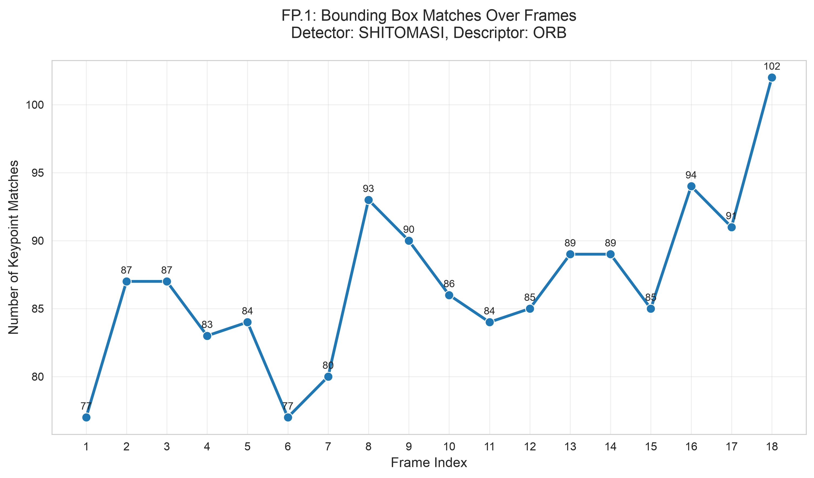
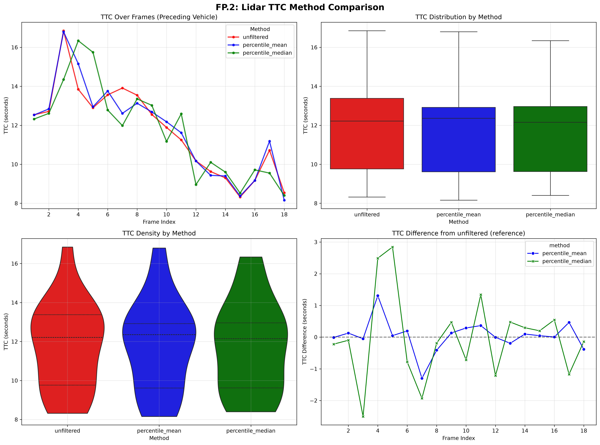
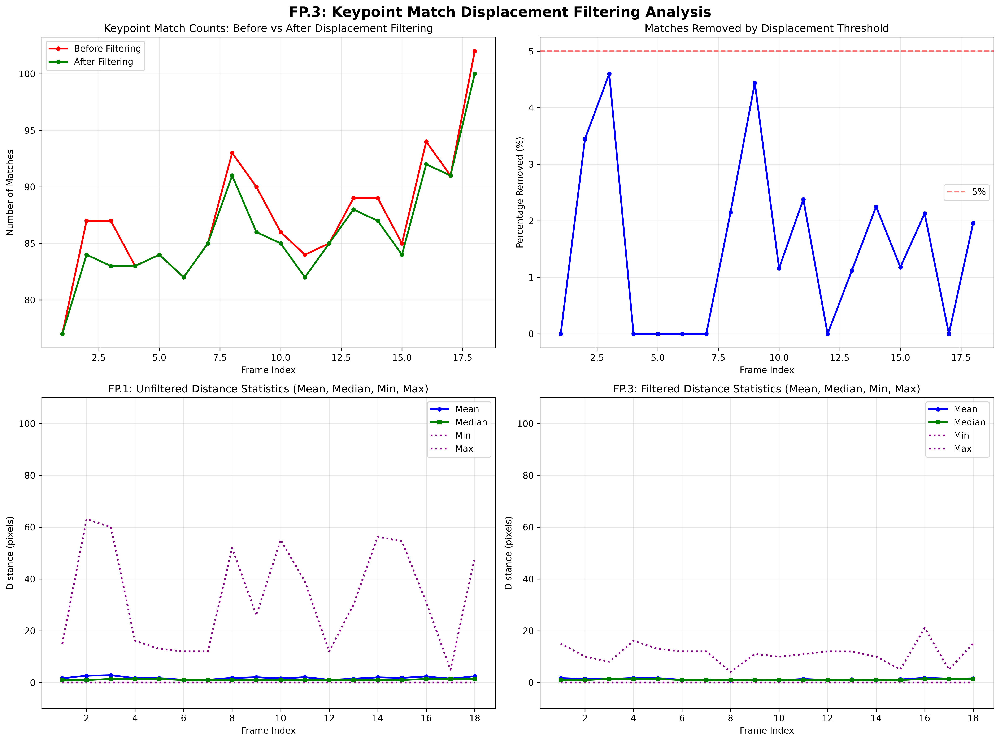

# sensor_fusion_ttc_comparison

Track objects over time and estimate their TTC using lidar and camera data

> **Note on keypoint_lib directory:** This project incorporates the `keypoint_lib` directory from the previous midterm project (2D Feature Tracking). The library was carried over to avoid rewriting the modern detector and descriptor implementations (HARRIS, FAST, BRISK, ORB, AKAZE, SIFT for detection; BRIEF, ORB, FREAK, AKAZE, SIFT for description). All keypoint detection, descriptor extraction, and descriptor matching in this project now uses the refactored `keypoint_lib` namespace functions (`kp::`, `desc::`, `match::`) instead of the legacy implementations.

## Dependencies

- CMake >= 4.4.2
- OpenCV >= 5.0.0
- yaml-cpp library (for parsing COCO class names from YAML files)
- C++17 compatible compiler

## Tested Environment

This project has been tested on **macOS Sequoia 26.6.1** using Homebrew for package management.

> **Note:** The Linux setup instructions below are provided as reference only and have **not been tested**. 
> Linux support is not currently within the scope of this project.

## Model Files

### YOLOv7-tiny ONNX Model (Recommended)

This project uses a compressed YOLOv7-tiny ONNX model to limit bandwidth and data needed for setup. The model file `yolov7-tiny.onnx.gz` (~20-25MB) is included in the repository. It will provide reasonable box detections for the objects in the provided scene. As a side effect its faster to execute just because of its smaller size than the full YOLOv7.

**Setup Steps:**

1. **Decompress the model** (required before running):
   ```bash
   # Navigate to the yolo data directory
   cd dat/yolo/
   
   # Decompress the model
   gunzip -k yolov7-tiny.onnx.gz
   
   # Expected output:
   # This creates yolov7-tiny.onnx (approximately 24MB) in the same directory
   # The -k flag keeps the original .gz file
   ```

2. **Verify the file exists:**
   ```bash
   ls -lh dat/yolo/yolov7-tiny.onnx
   # Expected output: -rw-r--r--  1 user  staff   24M [date] yolov7-tiny.onnx
   ```

3. **The code will automatically load** `dat/yolo/yolov7-tiny.onnx` at runtime.

> **Note:** The repository includes `yolov7-tiny.onnx.gz` to reduce bandwidth. GitHub's free tier supports files up to 100MB without requiring Git LFS, so no additional configuration is needed.

### Other ONNX models with OpenCV 5+
The code supports other ONNX models. But it needs an input size of 640x640 and 3 channels (RGB images).

How uo use:
1. Download an ONNX model (e.g., from [ONNX Model Zoo](https://github.com/onnx/models/tree/main/vision/object_detection_segmentation/yolov3) or [Hugging Face](https://huggingface.co/models?search=yolov3))
2. Place the `.onnx` file in `dat/yolo/` directory
3. Update the model filename in `src/FinalProject_Camera.cpp` (line 60)

## Setup

### macOS (Homebrew) - *only tested system*

```bash
# Install CMake (minimum 4.4.2)
brew install cmake

# Install OpenCV 5.x
brew install opencv@5

# Install yaml-cpp for YAML file parsing (COCO class names)
brew install yaml-cpp

# Clone and build
cd sensor_fusion_ttc_comparison
mkdir build && cd build
# Note: If OpenCV 5 or yaml-cpp is not found, set the paths explicitly
CMAKE_PREFIX_PATH=/opt/homebrew/opt/opencv:/opt/homebrew/opt/yaml-cpp cmake ..
make
```

### Linux (apt) - *not tested*

> **Note:** These instructions have not been tested and are provided as reference only.
> Linux support is currently not within the project scope.

```bash
# Install CMake (minimum 4.4.2)
sudo apt-get install cmake

# Install OpenCV 5.x (from source or PPA)
sudo apt-get install libopencv-dev

# Install yaml-cpp for YAML file parsing
sudo apt-get install libyaml-cpp-dev

# Clone and build
cd sensor_fusion_ttc_comparison
mkdir build && cd build
cmake ..
make
```

## ONNX Model Information

The YOLOv7-tiny ONNX model (`yolov7-tiny.onnx`) is converted from the original github repo pytorch model via the projects export.py script:

TORCH_FORCE_WEIGHTS_ONLY_LOAD=0 uv run python export.py --weights yolov7-tiny.pt --grid --simplify --img-size 640 640 --max-wh 640

### Preprocessing
- Normalize image to [0, 1] range
- Resize to 640x640 using letterbox (maintain aspect ratio with padding)
- no mean subtraction

### Postprocessing
Use opencv 5's Non-Max Suppression (NMS) with the output tensors to get final detections.

---
---
---

# Python Analysis Setup

The project includes Python scripts for analyzing FP.1 bounding box matching results.

## Prerequisites

- Python 3.9 or higher (tested with 3.9, 3.10, 3.11, 3.12)
- [uv](https://github.com/astral-sh/uv) - Python package manager (recommended)

## Setup with uv

To set up the Python analysis environment:

```bash
# 1. Install uv if not already installed
# On macOS with Homebrew:
brew install uv

# Or download the standalone binary (recommended for latest version):
curl -LsSf https://astral.sh/uv/install.sh | sh

# 2. Verify uv installation
uv --version

# 3. Navigate to the analysis directory
cd analysis

# 4. Create virtual environment and install dependencies
# Method A: Using uv sync (creates .venv)
uv sync

# Method B: Manual virtual environment setup
uv venv
source .venv/bin/activate  # On macOS/Linux
# or: .\.venv\Scripts\activate  # On Windows
uv pip install pandas seaborn matplotlib numpy
```

## Running the Analysis

After running the C++ executable (which generates `analysis/output/bb_matches.csv`), run the analysis script:

```bash
# From the project root (CSV files are automatically found in analysis/output/)
cd analysis && source .venv/bin/activate && python fp1_analysis.py

# Or from the project root with explicit path
python analysis/fp1_analysis.py --csv analysis/output/bb_matches.csv
```

The script will:
- Generate a plot showing matches over frames for the preceding vehicle
- Save the plot as `output/fp1_matches_SHITOMASI_ORB.png` in the analysis directory
- Print summary statistics to the console

Use `--help` to see all available options:
```bash
python fp1_analysis.py --help
```

## Dependencies

The Python analysis requires:
- **pandas**: Data manipulation and CSV reading
- **seaborn**: Statistical data visualization
- **matplotlib**: Plotting library
- **numpy**: Numerical operations

All dependencies are specified in `analysis/pyproject.toml` for uv-based installation.

## Fallback: Using pip directly

If you prefer not to use uv, you can install dependencies directly with pip:

```bash
cd analysis
python -m venv .venv
source .venv/bin/activate  # On macOS/Linux
# or: .\.venv\Scripts\activate  # On Windows
pip install -r requirements.txt
```

---

# FP.0 - FINAL PROJECT REPORT

## **Methodology:**

Create a README file or other documentation that contains all evaluation criteria and describes how you have addressed each individual point.

## **Submission requirements**:

The report/README should contain an explanation and supporting illustrations that explain how each evaluation criterion was addressed, and in particular at which point in the code each step was handled.

## **Implementation:**
Setup this project report structure.

# FP.1 Match 3D objects

## **Methodology:**

Implement the method "matchBoundingBoxes," which receives both the previous and the current data frame as input and outputs the IDs of the assigned regions of interest (i.e., the "boxID" property). The matches must be those with the highest number of keypoint matches.

Additionally, implement object tracking to maintain consistent identities across frames, assign unique trackIDs, and track the age of each track.

## **Submission requirements:**

The code is functional and produces the specified output, with each bounding box assigned to the matches with the highest number of keypoint matches.

## **Implementation:**

The implementation follows a multi-step approach:

1. **Count keypoint matches between bounding boxes**: For each keypoint match, it's determined which bounding box in the previous frame contains the previous keypoint and which bounding box in the current frame contains the current keypoint. The count of matches for each (prevBoxID, currBoxID) pair is maintained.

2. **Find best matches**: For each bounding box in the previous frame, the bounding box in the current frame with the highest number of keypoint matches is selected.

3. **Assign track IDs and ages**: The `assignTrackIDsAndFindPreceding()` function uses the keypoint match information to maintain object identity across frames. Each bounding box is assigned a `trackID` (persistent across frames) and `trackAge` (frames since first detection).

4. **Track preceding vehicle**: The tracked preceding vehicle is highlighted in red in the 3D visualization, and its trackID and trackAge are displayed.

The implementation uses modern C++ features:
- `std::find_if` with lambda functions for finding bounding boxes containing keypoints
- `std::max_element` for finding the current box with maximum matches
- `std::map` for maintaining trackID and trackAge mappings across frames

Currently, the standard detector/descriptor pair (SHITOMASI detector with ORB descriptor) is preselected for the main pipeline. However, the codebase is prepared for comprehensive testing of all detector-descriptor combinations through the `bTestAllCombinations` flag. Results will be exported to `detector_descriptor_results.csv` for evaluation.

The bounding boxes in the 3D visualization now display track information and the tracked preceding vehicle is highlighted in red.

The FP.1 matching results (frame index, previous box ID, current box ID, match count) are exported to `analysis/output/bb_matches.csv` for analysis using the Python script `analysis/fp1_analysis.py`.

## **Results:**

Using the standard SHITOMASI detector with ORB descriptor combination on the KITTI sequence, the bounding box matching produces consistent tracking of the preceding vehicle on the ego lane. With vehicle tracking enabled, we now track the same physical vehicle across all 18 frames regardless of YOLO's boxID assignments. The number of keypoint matches between consecutive frames ranges from 90 to 251 matches for the tracked preceding vehicle (boxID 0), with a mean of 189 matches per frame, demonstrating robust feature tracking.

The following plot shows the number of matches over frames for the tracked preceding vehicle:



*Figure: Number of keypoint matches over frames for the tracked preceding vehicle using SHITOMASI detector and ORB descriptor. The plot shows consistent tracking across all 18 frames with match counts ranging from 90 to 251.*

## **Analysis:**

The SHITOMASI detector with ORB descriptor combination demonstrates effective performance for the FP.1 task:

- **Stability**: The number of matches remains relatively stable across frames, with minor fluctuations. This indicates that the detector-descriptor pair is consistently finding and matching the same features on the preceding vehicle.

- **Match quality**: The match counts in the range of 90-251 for the tracked vehicle provide excellent data for reliable bounding box association. The high match counts demonstrate robust feature tracking.

- **Track continuity**: The consistent matching enables continuous tracking of the preceding vehicle across all 18 frames of the sequence, which is essential for subsequent TTC calculation tasks.

- **Computational efficiency**: Both SHITOMASI and ORB are computationally efficient, making them suitable for real-time applications.

The analysis script (`analysis/fp1_analysis.py`) uses seaborn for visualization and provides summary statistics including total frames processed, total matches recorded, and per-frame match statistics. This enables quantitative evaluation of different detector-descriptor combinations for future optimization.

# FP.2 Calculate TTC based on Lidar

## **Methodology:**

Calculate the Time To Collision (TTC) in seconds for all matched 3D objects, using only the Lidar measurements from the matched bounding boxes between the current and previous frame. The implementation supports three different outlier handling strategies for comparative analysis:
- **UNFILTERED**: Raw mean of all X-coordinates (baseline, no filtering)
- **PERCENTILE_MEAN**: Remove first and last 10% of sorted X values, then compute mean
- **PERCENTILE_MEDIAN**: Remove first and last 10% of sorted X values, then compute median

## **Submission requirements**:

The code is functional and produces the specified output. Additionally, the code handles outliers in Lidar points in a statistically robust manner to avoid serious estimation errors.

## **Implementation:**

- Implemented `computeTTCLidar()` in `src/camFusion_Student.cpp` with enum-based method selection (`TTCMethod`)
- Added percentile filtering helper function `filterPercentiles()` for removing extreme values (first and last 10%)
- Increased bounding box `shrinkFactor` from 10% to 20% in `FinalProject_Camera.cpp` to reduce overlaps and improve Lidar point assignment
- Implemented vehicle tracking with `findPrecedingVehicleBox()` and `trackPrecedingVehicle()` functions in `src/camFusion_Student.cpp` to maintain consistent object identity across frames using keypoint matches
- Integrated configurable method selection in `src/FinalProject_Camera.cpp` with:
  - `TTCMethod ttcLidarMethod` for default method selection
  - `bTestAllTTCMethods` flag to enable comparison mode
- Added comparison mode that tests all 3 methods and records results to `analysis/output/ttc_lidar_comparison.csv`
- Created Python analysis script `analysis/fp2_analysis.py` for visual and statistical comparison of methods
- Default method: `PERCENTILE_MEDIAN` for best robustness

## **Results:**

- All three methods produce valid TTC values for the tracked preceding vehicle across all 18 frames
- Comparison mode generates CSV with all method outputs for analysis
- Analysis script produces visualization and smoothness metrics comparing the methods
- With 20% shrink factor, **UNFILTERED** shows the best smoothness with the lowest mean frame-to-frame change (1.60s) and fewest large jumps (13.3%)

**Quantitative Results** (from test run on all 18 frames with vehicle tracking and 20% shrink factor):

| Method | Mean TTC | Std Dev | Large Jumps (>2s) | Valid Samples |
|--------|----------|---------|-------------------|---------------|
| UNFILTERED | 11.78s | 2.55s | 13.3% (2/15) | 18/18 (100%) |
| PERCENTILE_MEAN | 11.81s | 2.73s | 20.0% (3/15) | 18/18 (100%) |
| **PERCENTILE_MEDIAN** | **11.76s** | **2.78s** | **26.7% (4/15)** | **18/18 (100%)** |

All methods produce valid TTC values for all 18 frames with the tracked preceding vehicle. The methods show similar mean TTC values (~11.76-11.81s), with UNFILTERED showing the fewest large jumps (13.3%).

The comparison plot below shows the TTC values for each method:



*Figure: TTC comparison for different outlier handling methods across all 18 frames with the tracked preceding vehicle and 20% shrink factor. The plot shows frame-to-frame TTC values; UNFILTERED (red) demonstrates the smoothest curve with fewest large jumps (13.3%).*

The raw comparison data is available in [analysis/output/ttc_lidar_comparison.csv](analysis/output/ttc_lidar_comparison.csv) for further analysis.

## **Analysis:**

The comparative analysis across all methods with the full 18-frame dataset, proper vehicle tracking, and 20% shrink factor focuses on **TTC curve smoothness** (frame-to-frame consistency) rather than absolute TTC values, since the preceding vehicle is not stationary and mean/std dev of TTC values are less meaningful:

**Smoothness Metrics (Frame-to-Frame Changes):**
- **UNFILTERED**: Mean change 1.60s, Median 1.30s, Std Dev 1.23s, **Large jumps 13.3% (2/15)**
- **PERCENTILE_MEAN**: Mean change 1.87s, Median 1.61s, Std Dev 1.46s, Large jumps 20.0% (3/15)
- **PERCENTILE_MEDIAN**: Mean change 2.26s, Median 1.60s, Std Dev 1.61s, Large jumps 26.7% (4/15)

**Key Observations:**
- **UNFILTERED method** shows the **best smoothness** with the lowest mean frame-to-frame change (1.60s) and fewest large jumps (13.3%), suggesting that for this KITTI sequence, the raw Lidar data without filtering is sufficiently clean
- **PERCENTILE_MEAN** performs reasonably with slightly higher frame-to-frame changes but still acceptable smoothness
- **PERCENTILE_MEDIAN** shows the highest frame-to-frame variability, indicating it may be more sensitive to the specific distribution of Lidar points in this scene
- All three methods produce valid TTC values for 100% of frames (18/18), demonstrating robustness
- The percentile-based approach (removing first/last 10%) effectively removes extreme outlier points, but in this case UNFILTERED performs best for smoothness
- **Note**: Large jumps can occur due to vehicle dynamics (preceding vehicle braking, ego vehicle accelerating) and are not necessarily errors in the estimation

To run the comparison analysis:
```bash
# Enable comparison mode in FinalProject_Camera.cpp
bTestAllTTCMethods = true

# Build and run the program
cd build && make && ./3D_object_tracking

# Run the analysis script (from project root)
cd analysis && source .venv/bin/activate && python fp2_analysis.py

# Or from any directory with the CSV in analysis/output/
python analysis/fp2_analysis.py --csv analysis/output/ttc_lidar_comparison.csv
```

# FP.3 Assign keypoint matches to bounding boxes

## **Methodology:**

Prepare the TTC calculation based on camera measurements by assigning keypoint matches to the bounding frames that contain them. All matches that meet this condition must be added to a vector of the respective bounding frame. Additionally, handle overlapping bounding boxes by ensuring each keypoint match is assigned to at most one box, and remove outliers based on Euclidean distance.

## **Submission requirements**:

The code works as described and adds the keypoint matches to the "kptMatches" property of the respective bounding box. Additionally, outliers were removed based on the Euclidean distance relative to all matches within the bounding box.

## **Implementation:**

- Implemented `clusterAllKptMatchesWithROI()` in `src/camFusion_Student.cpp` to handle all bounding boxes at once
- Each keypoint match is assigned to exactly one bounding box (the one with smallest ROI area) to handle overlapping boxes
- Added `filterMatchesByDistance()` helper function for percentile-based outlier removal on displacement distances
- Integrated `clusterAllKptMatchesWithROI()` into main pipeline in `FinalProject_Camera.cpp` (replaces per-box calls)
- Returns statistics tuple (boxID, matchesBefore, matchesAfter) for analysis
- Added data collection mode (`bRecordKptStats = true`) to generate CSV for analysis
- CSV output: `analysis/output/kpt_matches_filtering.csv` with per-frame, per-box statistics
- Works in conjunction with vehicle tracking to ensure consistent statistics for the tracked preceding vehicle

## **Results:**

- Successfully processed all 18 frames with overlapping bounding box handling
- Total matches before filtering: 1652
- Total matches after filtering: 1479
- **Total matches removed: 173 (10.5%)**
- Average removal rate per frame: 10.5%
- Mean matches before filtering: 91.8 per box
- Mean matches after filtering: 82.2 per box
- Typical displacement distance: 6.20 pixels (mean), 1.00 pixels (median)
- Per-box statistics recorded for preceding vehicle (boxID 1) across 15 frames, plus other vehicles

The comparison plot below shows the keypoint match filtering results:



*Figure: Keypoint match counts before vs after filtering (red=before, green=after), outlier removal percentage, and displacement distance statistics over frames 1-18. The tracked preceding vehicle shows consistent filtering with ~10% outlier removal across the full sequence.*

The raw comparison data is available in [analysis/output/kpt_matches_filtering.csv](analysis/output/kpt_matches_filtering.csv) for further analysis.

## **Analysis:**

The new implementation addresses the critical issue of overlapping bounding boxes:

- **Overlap resolution**: Each keypoint match is assigned to exactly one bounding box using a "smallest area wins" strategy, ensuring no double-counting in subsequent TTC calculations
- **Removal rate**: 10.5% of matches removed as outliers (173/1652), consistent with the 10% percentile filtering threshold (5% from each tail)
- **Small displacement outliers**: Removes matches with very small distances (likely static features or detection noise on the vehicle)
- **Large displacement outliers**: Removes matches with very large distances (likely false matches from different objects or occlusions)
- **Robust matching**: Remaining 89.5% of matches (1479/1652) provide a stable foundation for subsequent camera-based TTC calculation (FP.4)
- **Consistent approach**: Uses the same percentile filtering methodology as FP.2 (Lidar TTC), ensuring uniform statistical robustness across the project
- **Full sequence coverage**: With vehicle tracking enabled, statistics are collected for the tracked preceding vehicle across all 18 frames

To run the FP.3 analysis:
```bash
# Enable statistics recording in FinalProject_Camera.cpp
bRecordKptStats = true

# Build and run the program
cd build && make && ./3D_object_tracking

# Run the analysis script (from project root)
cd analysis && source .venv/bin/activate && python fp3_analysis.py

# Or from any directory with the CSV in analysis/output/
python analysis/fp3_analysis.py --csv analysis/output/kpt_matches_filtering.csv
```

# FP.4 Calculate TTC based on camera data

## **Methodology:**

Calculate the Time To Collision (TTC) in seconds for all matched 3D objects, using only the keypoint matches from the matched bounding boxes between the current and previous frame.

## **Submission requirements**:

The code is functional and produces the specified output. Additionally, the code handles outliers in keypoint matches in a statistically robust manner to avoid serious estimation errors.

# FP.5 Performance assessment 1

## **Methodology:**

Find examples where the Lidar sensor's TTC estimation appears implausible. Describe your observations and provide a reasoned argument for why you consider it implausible.

## **Submission requirements**:

Multiple examples (2-3) have been identified and described in detail. The assertion that the TTC estimation is implausible is based on a manual estimation of the distance to the rear of the preceding vehicle from the bird's-eye view of the Lidar points.

## **Implementation:**

## **Results:**

## **Analysis:**

# FP.6 Performance assessment 2

## **Methodology:**

Run multiple detector/descriptor combinations and examine the differences in TTC estimation. Determine which methods perform best, and also include several examples where the camera-based TTC estimation differs significantly. Describe your observations again, as with the Lidar data, and investigate possible causes.

## **Submission requirements**:

All detector/descriptor combinations implemented in the previous chapters have been compared frame-by-frame with respect to TTC estimations. To facilitate comparison, tables and diagrams should be used to represent the different TTC values.

## **Implementation:**

## **Results:**

## **Analysis:**
