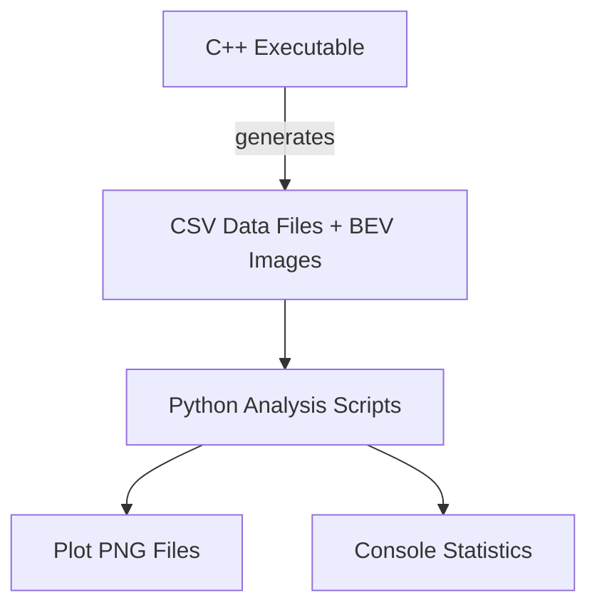

# FP.1 - FP.6 Analysis Scripts

This directory contains Python scripts for analyzing the FP.1 (Match 3D Objects), FP.2 (Lidar TTC), FP.3 (Keypoint Match Filtering), FP.4 (Camera TTC), FP.5 (Performance Assessment 1), and FP.6 (Performance Assessment 2) task results.

## Overview

The analysis scripts process data exported from the C++ `3D_object_tracking` executable and generate visualizations using seaborn and matplotlib. Each FP task has its own dedicated analysis script.

## Quick Start

```bash
# 1. First, run the C++ executable to generate analysis data
#    This creates CSV files in analysis/output/

# 2. Set up Python environment (choose one method):

# Method A: Using uv (recommended)
uv venv
source .venv/bin/activate  # macOS/Linux
# .\.venv\Scripts\activate  # Windows (not tested)
uv pip install pandas seaborn matplotlib numpy

# Method B: Using pip
python -m venv .venv
source .venv/bin/activate  # macOS/Linux
# .\.venv\Scripts\activate  # Windows
pip install -r requirements.txt

# 3. Run all analysis scripts (CSV files are automatically found in output/)
cd analysis && source .venv/bin/activate
python fp1_analysis.py
python fp2_analysis.py
python fp3_analysis.py
python fp4_analysis.py
python fp5_analysis.py  # Generate FP.5 BEV plot series
python fp6_analysis.py  # Run FP.6 detector/descriptor combination analysis
```

## Dependencies

| Package | Version | Purpose |
|---------|---------|---------|
| pandas | >= 1.5.0 | Data manipulation, CSV reading |
| seaborn | >= 0.12.0 | Statistical data visualization |
| matplotlib | >= 3.5.0 | Plotting library |
| numpy | >= 1.21.0 | Numerical operations |

Dependencies are specified in `pyproject.toml` for uv-based installation and in `requirements.txt` for pip-based installation.

## Scripts Overview

**Note:** All analysis scripts (FP.2, FP.3, FP.4, FP.5) support track_id filtering. They automatically read the tracked preceding vehicle's track_id from `output/tracked_preceding_vehicle_track_id.txt` (generated by the C++ executable) to filter results for the preceding vehicle on the ego lane.

| Script | FP Task | Purpose | Input CSV |
|--------|---------|---------|-----------|
| `fp1_analysis.py` | FP.1 | Bounding box match analysis | `bb_matches.csv` |
| `fp2_analysis.py` | FP.2 | Lidar TTC comparison analysis | `ttc_lidar_comparison.csv` |
| `fp3_analysis.py` | FP.3 | Keypoint match filtering analysis | `kpt_matches_filtering.csv` |
| `fp4_analysis.py` | FP.4 | Camera TTC analysis and scale distribution | `ttc_camera.csv`, `ttc_lidar_comparison.csv`, `ttc_camera_scale_stats.csv` |
| `fp5_analysis.py` | FP.5 | **BEV plot series** generation for bird's-eye view visualization | BEV PNG files from C++ executable |
| `fp6_analysis.py` | FP.6 | **Detector/descriptor combination analysis** using TTC smoothness and outlier metrics | `ttc_camera_combinations.csv` |

## FP.1 Analysis Script

### Purpose
Analyzes bounding box match data to show how keypoint matches for the tracked preceding vehicle change across frames.

### Usage
```bash
python fp1_analysis.py [--csv PATH] [--output DIR] [--detector NAME] [--descriptor NAME] [--all-boxes]
```

### Input
CSV file with columns: `frame_index`, `prev_box_id`, `curr_box_id`, `match_count`

### Output
- `fp1_matches_{detector}_{descriptor}.png` - Plot showing matches over frames
- Console statistics (frames processed, match counts, per-frame stats)

## FP.2 Analysis Script

### Purpose
Compares Lidar TTC values across different outlier handling methods (UNFILTERED, PERCENTILE_MEAN, PERCENTILE_MEDIAN).

### Usage
```bash
python fp2_analysis.py [--csv PATH] [--output DIR]
```

### Input
CSV file: `ttc_lidar_comparison.csv`

### Output
- `fp2_ttc_comparison.png` - TTC comparison plot across all methods
- Console statistics

## FP.3 Analysis Script

### Purpose
Analyzes keypoint match filtering results, showing match counts before and after displacement filtering.

### Usage
```bash
python fp3_analysis.py [--csv PATH] [--output DIR]
```

### Input
CSV file: `kpt_matches_filtering.csv`

### Output
- `fp3_kpt_comparison.png` - Keypoint match filtering comparison plot
- Console statistics

## FP.4 Analysis Script

### Purpose
Analyzes camera-based TTC estimation including scale distributions and keypoint pair filtering.

### Usage
```bash
python fp4_analysis.py --camera-csv PATH --lidar-csv PATH --scale-csv PATH [--output DIR]
```

### Input
CSV files: `ttc_camera.csv`, `ttc_lidar_comparison.csv`, `ttc_camera_scale_stats.csv`

### Output
- `fp4_ttc_comparison.png` - Camera vs Lidar TTC comparison
- `fp4_correlation_scatter.png` - Correlation scatter plot
- `fp4_scale_distributions.png` - Scale ratio distributions
- `fp4_keypoint_pair_filtering_pie.png` - Keypoint pair filtering impact
- Console statistics

## FP.5 Analysis Script

### Purpose
Generates a 6x3 thumbnail grid visualization of bird's-eye view (BEV) lidar point cloud images for all frames.

### Usage
```bash
python fp5_analysis.py
```

### Input
BEV PNG images: `preceding_vehicle_lidar_bev_*.png` (generated by C++ executable)

### Output
- `fp5_bev_plot_series.png` - 6x3 grid of BEV thumbnails

## FP.6 Analysis Script

### Purpose
Analyzes camera-based TTC estimation across all 35 detector/descriptor combinations (7 detectors x 5 descriptors). Uses TTC curve smoothness (frame-to-frame consistency) and largest outliers (deviation from cross-combination median) as the main evaluation criteria.

### Usage
```bash
python fp6_analysis.py [--csv PATH] [--lidar-csv PATH] [--output DIR]
```

### Input
CSV file: `ttc_camera_combinations.csv` (generated by C++ executable with `bTestAllCombinationsTTC = true`)

### Output
- `fp6_ttc_overview.png` - All combinations plotted with lidar reference
- `fp6_smoothness_ranking.png` - Smoothness metrics bar chart
- `fp6_outlier_analysis.png` - Outlier frames and combination deviations
- `fp6_top_combinations.png` - Best vs worst combinations side by side
- `fp6_statistics_table.png` - Full statistics table
- `fp6_outlier_frames_detail.png` - Top 3 outlier frames detail
- `fp6_smoothness_metrics.csv` - Smoothness metrics per combination

## Integration with C++ Pipeline

The analysis scripts are designed to work seamlessly with the C++ pipeline:



1. C++ code processes images, detects objects, and exports data to CSV files in `analysis/output/`
2. C++ code also generates BEV images for FP.5 analysis
3. Python scripts read the CSV files and BEV images, generate visualizations
4. Results can be committed to git (excluding generated CSV/PNG files)

## Project Structure

```
analysis/
├── README.md          # This file
├── fp1_analysis.py    # FP.1 analysis script
├── fp2_analysis.py    # FP.2 analysis script
├── fp3_analysis.py    # FP.3 analysis script
├── fp4_analysis.py    # FP.4 analysis script
├── fp5_analysis.py    # FP.5 BEV plot series generator
├── fp6_analysis.py    # FP.6 detector/descriptor combination analysis
├── pyproject.toml     # Project metadata and dependencies
├── requirements.txt   # Pip-compatible dependencies
├── output/           # Generated analysis artifacts
│   ├── bb_matches.csv        # FP.1 bounding box match data
│   ├── ttc_lidar_comparison.csv # FP.2 TTC comparison data
│   ├── kpt_matches_filtering.csv # FP.3 keypoint match filtering data
│   ├── ttc_camera.csv        # FP.4 camera TTC data
│   ├── ttc_camera_scale_stats.csv # FP.4 scale statistics data
│   └── *.png                 # Generated plots
└── .venv/            # Python virtual environment
```
