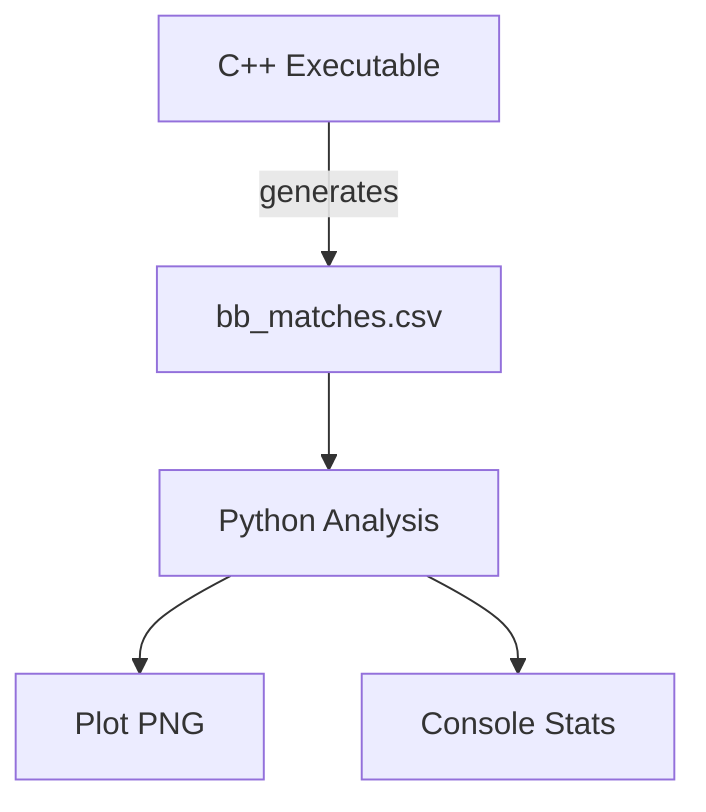

# FP.1 Analysis Scripts

This directory contains Python scripts for analyzing the FP.1 (Match 3D Objects) task results.

## Overview

The `fp1_analysis.py` script processes bounding box match data exported from the C++ `3D_object_tracking` executable and generates visualizations using seaborn and matplotlib.

## Quick Start

```bash
# 1. First, run the C++ executable to generate match data
#    This creates bb_matches.csv in the project root

# 2. Set up Python environment (choose one method):

# Method A: Using uv (recommended)
uv venv
source .venv/bin/activate  # macOS/Linux
# .\.venv\Scripts\activate  # Windows (not tested)
uv pip install pandas seaborn matplotlib numpy

# Method B: Using pip
python -m venv .venv
source .venv/bin/activate  # macOS/Linux
# .\.venv\Scripts\activate  # Windows
pip install -r requirements.txt

# 3. Run the analysis
python fp1_analysis.py --csv ../bb_matches.csv
```

## Dependencies

| Package | Version | Purpose |
|---------|---------|---------|
| pandas | >= 1.5.0 | Data manipulation, CSV reading |
| seaborn | >= 0.12.0 | Statistical data visualization |
| matplotlib | >= 3.5.0 | Plotting library |
| numpy | >= 1.21.0 | Numerical operations |

Dependencies are specified in `pyproject.toml` for uv-based installation and in `requirements.txt` for pip-based installation.

## Usage

### Basic Usage

```bash
# Run with default settings (looks for bb_matches.csv in current directory)
python fp1_analysis.py

# Specify custom CSV path
python fp1_analysis.py --csv ../bb_matches.csv

# Specify output directory for plots
python fp1_analysis.py --csv ../bb_matches.csv --output ./plots

# Use custom detector/descriptor names in plot title
python fp1_analysis.py --csv ../bb_matches.csv --detector SHITOMASI --descriptor ORB
```

### All Options

```bash
python fp1_analysis.py --help
```

```
usage: fp1_analysis.py [-h] [--csv CSV] [--output OUTPUT] [--detector DETECTOR] [--descriptor DESCRIPTOR] [--all-boxes]

FP.1 Analysis: Plot bounding box matches over frames

optional arguments:
  -h, --help            show this help message and exit
  --csv CSV             Path to CSV file containing match data (default: bb_matches.csv)
  --output OUTPUT       Output directory for plots (default: .)
  --detector DETECTOR   Detector type for plot title (default: SHITOMASI)
  --descriptor DESCRIPTOR
                        Descriptor type for plot title (default: ORB)
  --all-boxes           Also plot matches for all bounding boxes
```

## Input Data Format

The script expects a CSV file with the following columns:

| Column | Type | Description |
|--------|------|-------------|
| frame_index | int | Image frame index in the sequence |
| prev_box_id | int | Bounding box ID from previous frame |
| curr_box_id | int | Bounding box ID from current frame |
| match_count | int | Number of keypoint matches between these boxes |

Example CSV content:
```csv
frame_index,prev_box_id,curr_box_id,match_count
1,0,0,45
1,1,1,12
2,0,0,52
2,1,1,8
...
```

This CSV is automatically generated by the `3D_object_tracking` executable after processing the image sequence.

## Output

### Files Generated

1. **`fp1_matches_{detector}_{descriptor}.png`** - Plot showing matches for the preceding vehicle over frames
2. **Console output** - Summary statistics including:
   - Total frames processed
   - Total matches recorded
   - Unique bounding box pairs
   - Per-frame statistics (count, mean, std, min, max)

### Example Output

```
============================================================
SUMMARY STATISTICS
============================================================
Total frames: 18
Total matches recorded: 18
Unique bounding box pairs: 18

Per-frame statistics:
              count   mean        std  min   25%   50%   75%   max
frame_index
1                1  45.00   0.00000  45.0  45.0  45.0  45.0  45.0
2                1  52.00   0.00000  52.0  52.0  52.0  52.0  52.0
...

============================================================
Plot saved to: fp1_matches_SHITOMASI_ORB.png
```

## Examples

### Example 1: Standard Analysis

```bash
# Run the C++ executable
./3D_object_tracking

# Then run analysis
python analysis/fp1_analysis.py --csv bb_matches.csv
```

This generates a plot showing how the number of matches for the preceding vehicle (boxID 0) changes across frames.

### Example 2: Compare Different Detector/Descriptor Pairs

If you've run the C++ executable with different detector/descriptor combinations:

```bash
# Run with SHITOMASI + ORB (default)
./3D_object_tracking
cp bb_matches.csv bb_matches_shitomasi_orb.csv

# Edit FinalProject_Camera.cpp to use HARRIS + SIFT
# Then recompile and run
./3D_object_tracking
cp bb_matches.csv bb_matches_harris_sift.csv

# Analyze both
python fp1_analysis.py --csv bb_matches_shitomasi_orb.csv --detector SHITOMASI --descriptor ORB
python fp1_analysis.py --csv bb_matches_harris_sift.csv --detector HARRIS --descriptor SIFT
```

### Example 3: Analyze All Bounding Boxes

To see matches for all detected objects, not just the preceding vehicle:

```bash
python fp1_analysis.py --csv bb_matches.csv --all-boxes
```

This generates an additional plot (`fp1_all_boxes_SHITOMASI_ORB.png`) showing separate lines for each bounding box.

### Example 4: Batch Analysis for All Combinations

When `bTestAllCombinations = true` in the C++ code, it tests all detector-descriptor pairs and saves results to `detector_descriptor_results.csv`. You can process these results separately.

## Understanding the Results

### Preceding Vehicle Focus

By default, the script focuses on **boxID 0**, which is typically the preceding vehicle on the ego lane in the KITTI sequence. This is the most important object for TTC (Time-to-Collision) calculations.

### Match Count Interpretation

- **Higher values** (50-100+): Strong feature matching, reliable tracking
- **Medium values** (20-50): Adequate tracking, some feature loss between frames
- **Lower values** (<20): Weak tracking, may indicate occlusion or rapid appearance change

### Typical Patterns

1. **Stable tracking**: Match counts remain relatively consistent across frames
2. **Occlusion**: Sudden drop in matches when object is partially hidden
3. **Appearance change**: Gradual decrease as vehicle moves or lighting changes

## Integration with C++ Pipeline

The analysis script is designed to work seamlessly with the C++ pipeline:



1. C++ code processes images, detects objects, matches bounding boxes
2. Match data exported to `bb_matches.csv`
3. Python script reads CSV, generates visualizations and statistics
4. Results can be committed to git (excluding generated CSV/PNG files)

## Project Structure

```
analysis/
├── README.md          # This file
├── fp1_analysis.py    # Main analysis script
├── pyproject.toml     # Project metadata and dependencies
├── requirements.txt   # Pip-compatible dependencies
└── *.png              # Generated plots (gitignored)
```
